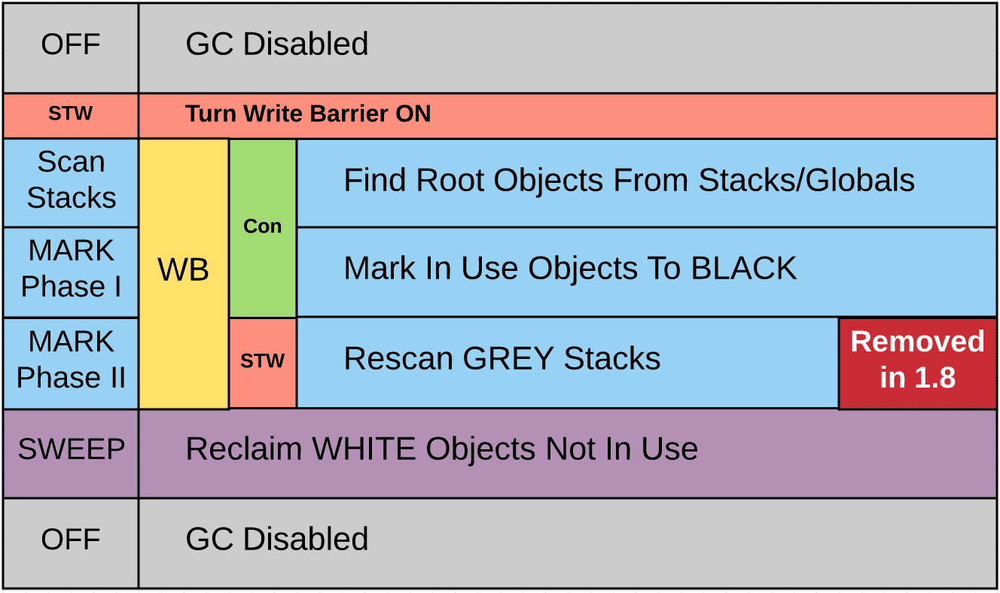

<meta name="referrer" content="no-referrer" />

 垃圾回收(Garbage Collection，简称GC)是编程语言中提供的自动的内存管理机制，自动释放不需要的对象，让出存储器资源，无需程序员手动执行。

# 常见GC方法
## 引用计数
 引用计数通过在对象上增加自己被引用的次数，被其他对象引用时加1，引用自己的对象被回收时减1，引用数为0的对象即为可以被回收的对象。这种算法在内存比较紧张和实时性比较高的系统中使用的比较广泛，如ios cocoa框架，php，python等。
 
 优点:
 1. 渐进式。内存管理与用户程序的执行交织在一起，将 GC 的代价分散到整个程序.
 2. 实现简单
 3. 内存能及时回收，相比于其他垃圾回收算法，堆被耗尽或者达到某个阈值才会进行垃圾回收。
 
 缺点:
 1. 原始的引用计数不能处理循环引用。大概这是被诟病最多的缺点了（后面有针对这些问题有相对解决办法比如强引用）。
 2. 维护引用计数降低运行效率。内存单元的更新删除等都需要维护相关的内存单元的引用计数，相比于一些追踪式的垃圾回收算法并不需要这些代价。 
 
## 标记清除法
 标记-清扫算法是第一种自动内存管理，基于追踪的垃圾收集算法。算法思想在 70 年代就提出了，是一种非常古老的算法。内存单元并不会在变成垃圾立刻回收，而是保持不可达状态，直到到达某个阈值或者固定时间长度。这个时候系统会挂起用户程序，也就是 STW，转而执行垃圾回收程序。垃圾回收程序对所有的存活单元进行一次全局遍历确定哪些单元可以回收。算法分两个部分：标记（mark）和清扫（sweep）。 
 优点：
 1. 避免循环引用
 
 缺点:
 1. 在标记清除的过程会暂停整个程序运行
 
 标记清除过程
 

## 复制收集
 复制收集的方式只需要对对象进行一次扫描。准备一个「新的空间」，从根开始，对对象进行扫，如果存在对这个对象的引用，就把它复制到「新空间中」。一次扫描结束之后，所有存在于「新空间」的对象就是所有的非垃圾对象。
 
 优点:
 1. 程序员运行并行执行，不干扰程序运行
 
 缺点:
 2. 需要额外开辟内存

## 分代收集
 这种收集方式用了程序的一种特性：大部分对象会从产生开始在很短的时间内变成垃圾，而存在的很长时间的对象往往都有较长的生命周期。根据对象的存活周期不同将内存划分为新生代和老年代，存活周期短的为新生代，存活周期长的为老年代。这样就可以根据每块内存的特点采用最适当的收集算法。新创建的对象存放在称为 新生代（young generation）中（一般来说，新生代的大小会比 老年代小很多）。高频对新生成的对象进行回收，称为「小回收」，低频对所有对象回收，称为「大回收」。每一次「小回收」过后，就把存活下来的对象归为老年代，「小回收」的时候，遇到老年代直接跳过。大多数分代回收算法都采用的「复制收集」方法，因为小回收中垃圾的比例较大。
   
## 三色标记法
 算是标记清除法的一个变种。将标记和清除分离两个步骤，减少影响程序运行的时间。另外引入写屏障，使得暂停时间减少。
 
 算法步骤如下:
  1. 起初所有对象都是白色。
  2. 从根出发扫描所有可达对象，标记为灰色，放入待处理队列。
  3. 从队列取出灰色对象，将其引用对象标记为灰色放入队列，自身标记为黑色。
  4. 重复 3，直到灰色对象队列为空。此时白色对象即为垃圾，进行回收。
  
  如下图
  

# Golang GC
## gc触发时机
 触发gc的条件有三种
 1. 内存增长当内存分配过程中，当分配的对象大小 >32kb，或是分配小对象时发现 span 已经满了时，会触发 GC
 2. 强制触发 通过调用 runtime.GC() 函数，这是阻塞式的。启用的时候会堵塞调用者直到垃圾回收完成。
 3. 时间触发 Golang 本身会对运行状态进行监控，如果超过两分钟没有触发 GC 任务，则强制触发。

## gc参数
 不像java有一堆参数可以调整。golang基本没有提供多少参数可以设置，golang gc设计目的是尽量做到完美，减少开发者对这gc控制。目的是让开发者省心。

## gc发展历程
 golang gc是一直被人诟病。在1.3之前golang gc都不忍直视，golang黑历史。经过多年发展以及比起当初有很大进步，以下为golang gc发展里程碑。
 
 - v1.3 以前版本 STW（Stop The World） 这是最多人诟病的版本，gc方法较为简单。使用标记清除法，在执行gc的时候，会stop the world。无数golang开发团队都踩过这个坑，都避免引用大内存。尽量不要增加gc负担，减少gc运行时间。
 - v1.3 Mark STW, Sweep 并行。这个版本分离标记(Mark)和清除(Sweep)的步骤。和以前一样，也是先暂停所有任务执行并启动mark，mark完成后马上就重新启动被暂停的任务了，而是让sweep任务和普通协程任务一样并行的和其他任务一起执行。比起之前有50%的性能提升。
 - v1.5 三色标记法. 上文介绍过的gc算法。这种方法的mark操作是可以渐进执行的而不需每次都扫描整个内存空间，可以减少stop the world的时间。
 - v1.8 混合写屏障（hybrid write barrier）采用一种混合的 write barrier 方式来避免 堆栈重新扫描。混合屏障的优势在于它允许堆栈扫描永久地使堆栈变黑（没有STW并且没有写入堆栈的障碍），这完全消除了堆栈重新扫描的需要，从而消除了对堆栈屏障的需求。重新扫描列表。特别是堆栈障碍在整个运行时引入了显着的复杂性，并且干扰了来自外部工具（如GDB和基于内核的分析器）的堆栈遍历。
 
 go一路走来gc都在一直进步，虽然对比成熟的gc(如java的jvm)仍然有差距,相信随机技术发展以后会更好的

## gc各个阶段
 
 
### STW : 
 一些初始化准备工作，包括开启 Write Barrier，结束之前未完成的清除任务，清空对象池等,这个过程会Stop The World Phase。

### Scan Stacks :
 这个阶段开始所有对象都是白色，这阶段主要是开始找根对象。根对象一般是指栈中引用的对象。
 1. 扫描某个goroutine的栈，暂时停止这个goroutine。
 2. 找到的根对象标记为灰色，并加入到队列。
 3. 该栈标记为黑色。

### Mark Phase I :
 从队列中取出一个灰色对象,并进行以下操作。
 1. 将该对象标记为黑色。
 2. 将该对象引用的对象标记为灰色并加入到队列
 
 在这个时候并不会STW，GC是和程序并行运行的。但是这个时候运行的goroutine的栈会重新变成灰色。

### Mark Phase II - STW
 这个阶段是重新扫描上个阶段中变成灰色的栈，为了防止有栈重新又变成灰色，这个阶段会STW。如果有大量的活跃goroutine会造成较高的延迟。

### Sweep Phase
 这个阶段回收所有白色的对象。


# 写屏障
 程序对所有涉及修改对象内容的地方进行保护，被称为「写屏障」（Write Barrier）。
## STW
  STW 有两个过程:
  - 第一个是 GC 将要开始的时候，这个时候主要是一些准备工作，比如 enable write barrier。
  - 第二个过程就是上面提到的 re-scan 过程。如果这个时候没有 stw，用户程序反复分配新对象或者修改引用，GC 需要反复 rescan，那 mark 阶段就停不下来了。
  
  v1.5 的时候 STW 主要就耗在这 rescan 上了，后面 v1.8 实现了一种结合了 Yuasa-style deletion write barrier 和 Dijkstra-style insertion write barrier 的 hybrid write barrier，可以消除 rescan。

## 写屏障作用
 在三色标记中，以及标记过的对象。有了新的对象引用，比如已经标记为黑色的对象，引用了一个新的对象。
 
 
 A 是根对象，GC 遍历到 A 时，A 变黑，B 变灰；接着用户程序把 A 到 B 的引用改成了 A 到 C 的引用；然后 GC 接着开始遍历到 B，B 没有引用对象，B 变黑；此时灰色集合已空，标记结束，C 是白色集合所以被清理了。
 
 为了防止这种现象的发生，最简单的方式就是STW，直接禁止掉其他用户程序对对象引用关系的干扰，但是STW的过程有明显的资源浪费，对所有的用户程序都有很大影响，如何能在保证对象不丢失的情况下合理的尽可能的提高GC效率，减少STW时间呢？

## 屏障技术
 当回收器满足下面两种情况之一时，即可保证不会出现对象丢失问题。
 
 弱三色不变式：所有被黑色对象引用的白色对象都处于灰色保护状态（直接或间接从灰色对象可达）。 强三色不变式：不存在黑色对象到白色对象的指针。
 
 强三色不变式很好理解，强制性的不允许黑色对象引用白色对象即可。而弱三色不变式中，黑色对象可以引用白色对象，但是这个白色对象仍然存在其他灰色对象对它的引用，或者可达它的链路上游存在灰色对象。
 
 三色抽象除了可以用于描述对象的状态的，还可用来描述赋值器的状态，如果一个赋值器已经被回收器扫描完成，则认为它是黑色的赋值器，如果尚未扫描过或者还需要重新扫描，则认为它是灰色的赋值器。
 
 在强三色不变式中，黑色赋值器只存在到黑色对象或灰色对象的指针，因为此时所有黑色对象到白色对象的引用都是被禁止的。 在弱三色不变式中，黑色赋值器允许存在到白色对象的指针，但这个白色对象是被保护的。上述这些可以通过屏障技术来保证。

## 插入屏障
 插入屏障拦截将白色指针插入黑色对象的操作，标记其对应对象为灰色状态，这样就不存在黑色对象引用白色对象的情况了，满足强三色不变式，如上图例中，在插入指针f时将C对象标记为灰色。Go1.5版本使用的Dijkstra写屏障就是这个原理，伪代码如下：
 
 ```go
 writePointer(slot, ptr):
     shade(ptr)
     *slot = ptr
 ```

## 删除屏障
 删除屏障也是拦截写操作的，但是是通过保护灰色对象到白色对象的路径不会断来实现的。如上图例中，在删除指针e时将对象C标记为灰色，这样C下游的所有白色对象，即使会被黑色对象引用，最终也还是会被扫描标记的，满足了弱三色不变式。这种方式的回收精度低，一个对象即使被删除了最后一个指向它的指针也依旧可以活过这一轮，在下一轮GC中被清理掉。Yuasa屏障伪代码如下：

 ```go
 writePointer(slot, ptr):
     if (isGery(slot) || isWhite(slot))
         shade(*slot)
     *slot = ptr
 ```
 在这种实现方式中，回收器悲观的认为所有被删除的对象都可能会被黑色对象引用。

## 混合写屏障
 插入屏障和删除屏障各有优缺点，Dijkstra的插入写屏障在标记开始时无需STW，可直接开始，并发进行，但结束时需要STW来重新扫描栈，标记栈上引用的白色对象的存活；Yuasa的删除写屏障则需要在GC开始时STW扫描堆栈来记录初始快照，这个过程会保护开始时刻的所有存活对象，但结束时无需STW。Go1.8版本引入的混合写屏障结合了Yuasa的删除写屏障和Dijkstra的插入写屏障，结合了两者的优点，伪代码如下：
  
 ```go
 writePointer(slot, ptr):
     shade(*slot)
     if current stack is grey:
         shade(ptr)
     *slot = ptr
 ```

 这里使用了两个shade操作，shade(*slot)是删除写屏障的变形，例如，一个堆上的灰色对象B，引用白色对象C，在GC并发运行的过程中，如果栈已扫描置黑，而赋值器将指向C的唯一指针从B中删除，并让栈上其他对象引用它，这时，写屏障会在删除指向白色对象C的指针的时候就将C对象置灰，就可以保护下来了，且它下游的所有对象都处于被保护状态。 如果对象B在栈上，引用堆上的白色对象C，将其引用关系删除，且新增一个黑色对象到对象C的引用，那么就需要通过shade(ptr)来保护了，在指针插入黑色对象时会触发对对象C的置灰操作。如果栈已经被扫描过了，那么栈上引用的对象都是灰色或受灰色保护的白色对象了，所以就没有必要再进行这步操作。
 
 Golang中的混合写屏障满足的是变形的弱三色不变式，同样允许黑色对象引用白色对象，白色对象处于灰色保护状态，但是只由堆上的灰色对象保护。由于结合了Yuasa的删除写屏障和Dijkstra的插入写屏障的优点，只需要在开始时并发扫描各个goroutine的栈，使其变黑并一直保持，这个过程不需要STW，而标记结束后，因为栈在扫描后始终是黑色的，也无需再进行re-scan操作了，减少了STW的时间。
 
# 关于GC性能
## GC时间
 ```
 Tgc = Tseq + Tmark + Tsweep(T表示time)
 ```
 Tseq表示是停止用户的goroutine和做一些准备活动（通常很小）需要的时间,Tmark是堆标记时间，标记发生在所有用户goroutine停止时，因此可以显著地影响处理的延迟,sweep是堆清除时间，清除通常与正常的程序运行同时发生，所以对延迟来说是不太关键的
 
 goroutine被停止后, GC将要开始的是时候会做一些准备工作,如写屏障设置等会执行STW,re-scan的时候执行STW,停止用户程序,检验已经扫描的元素是否发生引用的变化.

## GC优化
 当前GC的算法是固定的, 用户不能够配置垃圾回收的算法,唯一能够更改就是垃圾回收的阀值, 即GOGC, 用来表示触发GC的条件。当前能够提升垃圾回收效率的唯一方式就是减少垃圾的产生,可通过下面的方式
 
 - 内存分配合理
 - sync.Pool对象池,重复使用对象, 减少内存分配
 - append使用, 提前设置cap的数量, 避免无故扩容

### gc时间长的问题
 尽量避免频繁创建临时堆对象（如&abc{}, new, make等）以减少垃圾收集时的扫描时间，对于需要频繁使用的临时对象考虑直接通过数组缓存进行重用

### goroutine泄露的问题
 我们的一个服务需要处理很多长连接请求，实现时，对于每个长连接请求各开了一个读取和写入协程，全部采用endless for loop不停地处理收发数据。当连接被远端关闭后，如果不对这两个协程做处理，他们依然会一直运行，并且占用的channel也不会被释放…这里就必须十分注意，在不使用协程后一定要把他依赖的channel close并通过再协程中判断channel是否关闭以保证其退出

### 少量使用``+``连接string
 ``+``来进行string的连接会生成新的对象，降低gc的效率，好的方式是通过append函数来进行。

### string与[]byte转化
 在stirng与[]byte之间进行转换，会给gc造成压力 通过gdb，可以先对比下两者的数据结构：
 ```
  type = struct []uint8 { uint8 *array; int len; int cap;}
  type = struct string { uint8 *str; int len;}
 ```
 
 两者发生转换的时候，底层数据结结构会进行复制，因此导致gc效率会变低。
 解决策略上，一种方式是一直使用[]byte，特别是在数据传输方面，[]byte中也包含着许多string会常用到的有效的操作。
 另一种是使用更为底层的操作直接进行转化，避免复制行为的发生。主要是使用unsafe.Pointer直接进行转化
 


 
 