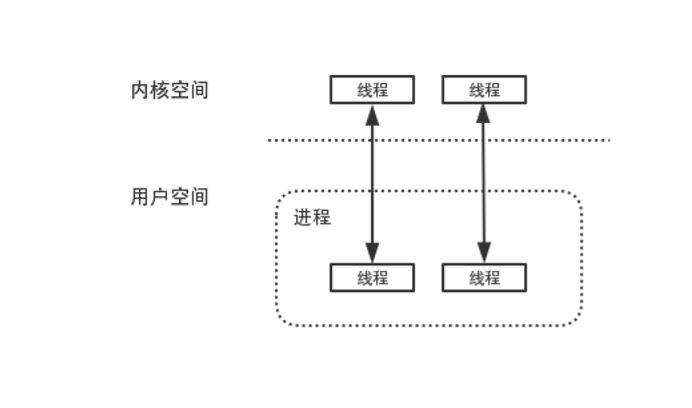
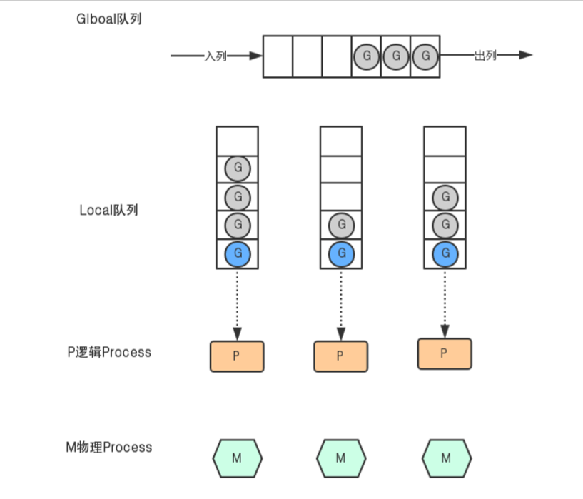
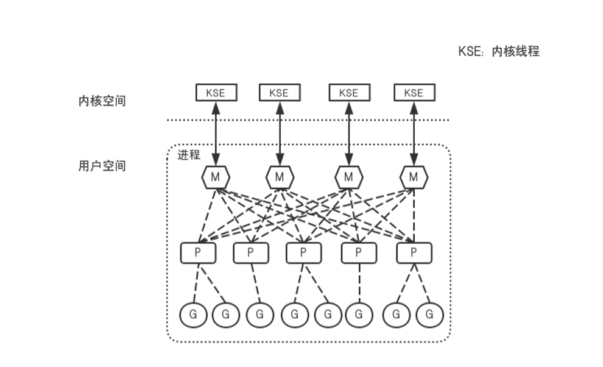
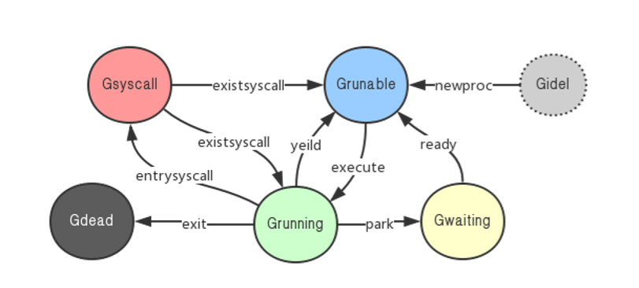

<meta name="referrer" content="no-referrer" />
 提起golang，莫过于goroutine，是其与其他语言最大的区别，原生支持并发。学习使用golang都有一段时间了，这里总结一下对goroutine的理解。
 
# 并发模型
 golang的并发单位是goroutine，是一种协程。协程是一种构建于线程之上的并发单位，比线程轻量，占用资源更小。
 
 一般并发模型有如下三种，内核级线程模型、用户级线程模型和两级线程模型（也称混合型线程模型），goroutine就是第三种混合型线程模型。

## 内核级线程
 cpu基本调度单位是线程，内核级线程就是cpu最小调度单位，一般称为的线程就是内核级别线程。内核级别线程。应用程序对线程的创建、终止以及同步都基于内核提供的系统调用来完成。比如java中的Thread实际是内核级别线程。实现简单，借助操作系统提供函数实现调度，能充分利用到多核cpu优势并行处理，但是线程创建销毁调用等都是内核操作比较消耗系统资源。

 

## 用户级线程
 如果说内核级线程模型:用户线程数:内核线程数 = 1 : 1。那么用户级线程模型的比例:N: 1，即一个内核线程里运行多个用户级线程。用户级线程运行在线程之上，不由内核系统参与创建、销毁以及同步，一般称为协程。比如python的gevent就是协程。由于线程调度是在用户层面完成不需要进行系统调用，这种实现方式轻量级，消耗资源少。因为所有协程都在一个内核线程上跑，不能做到真正并行处理，不能利用cpu多核优势。

 

## 两级线程
 两级线程模型是博采众长之后的产物，充分吸收前两种线程模型的优点且尽量规避它们的缺点。在此模型下，用户线程与内核KSE是多对多（N : M），且一个用户级线程可以在不同的内核线程运行。比如，某个内核线程因io阻塞调用被cpu挂起，内核线程中的用户级线程可以去到其他内核线程中运行。用户级线程由在用户层面完成调度，内核线程由系统内核处理，所以两级线程模型是自身调度与系统调度协同工作。Go语言中的runtime调度器实现这个二级线程模型，实现了goroutine和内核线程动态关联。

 

# GPM
 go的并发模型由Go Scheduler 来调度，其中包含三个概念G、P和M。

## G
 G代表goroutine的抽象，每一次使用go关键字都会创建G对象它包括栈、指令指针以及对于调用goroutines很重要的其它信息，比如阻塞它的任何channel。G要到了P中才会真正得到执行，以下为G的结构。
 
 ```go
type g struct {
  stack       stack   // 描述了真实的栈内存，包括上下界
  m              *m     // 当前的m
  sched          gobuf   // goroutine切换时，用于保存g的上下文      
  param          unsafe.Pointer // 用于传递参数，睡眠时其他goroutine可以设置param，唤醒时该goroutine可以获取
  atomicstatus   uint32
  stackLock      uint32 
  goid           int64  // goroutine的ID
  waitsince      int64 // g被阻塞的大体时间
  lockedm        *m     // G被锁定只在这个m上运行
 ```

 sched了保存了goroutine的上下文。goroutine切换的时候不同于线程有OS来负责这部分数据，而是由一个gobuf对象来保存，这样能够更加轻量级，以下为gobuf结构：
 
 ```go
 type gobuf struct {
     sp   uintptr
     pc   uintptr
     g    guintptr
     ctxt unsafe.Pointer
     ret  sys.Uintreg
     lr   uintptr
     bp   uintptr // for GOEXPERIMENT=framepointer
 }
 ```
 
 保存了当前的栈指针，计数器，当然还有g自身，这里记录自身g的指针是为了能快速的访问到goroutine中的信息。

## P
 Processor，表示逻辑处理器， 对G来说，P相当于CPU，由P来调度G的执行。P的数量由用户设置的GOMAXPROCS(最大值256)决定，P的数量决定了系统内最大可并行的G的数量（前提：物理CPU核数 >= P的数量）。每一个P保存着本地G任务队列，也有一个全局G任务队列。P结构如下。
 
 ```go
type p struct {
    lock mutex

    id          int32
    status      uint32 // 状态，可以为pidle/prunning/...
    link        puintptr
    schedtick   uint32     // 每调度一次加1
    syscalltick uint32     // 每一次系统调用加1
    sysmontick  sysmontick 
    m           muintptr   // 回链到关联的m
    mcache      *mcache
    racectx     uintptr

    goidcache    uint64 // goroutine的ID的缓存
    goidcacheend uint64

    // 可运行的goroutine的队列
    runqhead uint32
    runqtail uint32
    runq     [256]guintptr

    runnext guintptr // 下一个运行的g

    sudogcache []*sudog
    sudogbuf   [128]*sudog

    palloc persistentAlloc // per-P to avoid mutex

    pad [sys.CacheLineSize]byte
 }
 ```
 
 其中P的状态有Pidle, Prunning, Psyscall, Pgcstop, Pdead；在其内部队列runqhead里面有可运行的goroutine，P优先从内部获取执行的g，这样能够提高效率。

## M
 Machine，是内核级线程代表着真正执行计算的资源，在绑定有效的P后，进入schedule循环。而schedule循环的机制大致是从Global队列、P的Local队列以及wait队列中获取G，切换到G的执行栈上并执行G的函数，调用goexit做清理工作并回到M，如此反复。M并不保留G状态，这是G可以跨M调度的基础，M的数量是不定的，由Go Runtime调整，为了防止创建过多OS线程导致系统调度不过来，目前默认最大限制为10000个。m结构如下。
  
 ```go
type m struct {
    g0      *g     // 带有调度栈的goroutine

    gsignal       *g         // 处理信号的goroutine
    tls           [6]uintptr // thread-local storage
    mstartfn      func()
    curg          *g       // 当前运行的goroutine
    caughtsig     guintptr 
    p             puintptr // 关联p和执行的go代码
    nextp         puintptr
    id            int32
    mallocing     int32 // 状态

    spinning      bool // m是否out of work
    blocked       bool // m是否被阻塞
    inwb          bool // m是否在执行写屏蔽

    printlock     int8
    incgo         bool // m在执行cgo吗
    fastrand      uint32
    ncgocall      uint64      // cgo调用的总数
    ncgo          int32       // 当前cgo调用的数目
    park          note
    alllink       *m // 用于链接allm
    schedlink     muintptr
    mcache        *mcache // 当前m的内存缓存
    lockedg       *g // 锁定g在当前m上执行，而不会切换到其他m
    createstack   [32]uintptr // thread创建的栈
}
 ```

 结构体M中有两个G是需要关注一下的，一个是curg，代表结构体M当前绑定的结构体G。另一个是g0，是带有调度栈的goroutine，这是一个比较特殊的goroutine。普通的goroutine的栈是在堆上分配的可增长的栈，而g0的栈是M对应的线程的栈。所有调度相关的代码，会先切换到该goroutine的栈中再执行。也就是说线程的栈也是用的g实现，而不是使用的OS的。

## 调度过程

 go关键字创建一个G对象，G对象保存到P本地队列或者是全局队列。P此时去唤醒一个M。P继续执行它的执行序。M寻找是否有空闲的P，如果有则将该G对象移动到它本身。接下来M执行一个调度循环(调用G对象->执行->清理线程→继续找新的Goroutine执行)。

 M执行过程中，随时会发生上下文切换。当发生上线文切换时，需要对执行现场进行保护，以便下次被调度执行时进行现场恢复。Go调度器M的栈保存在G对象上，只需要将M所需要的寄存器(SP、PC等)保存到G对象上就可以实现现场保护。当这些寄存器数据被保护起来，就随时可以做上下文切换了，在中断之前把现场保存起来。如果此时G任务还没有执行完，M可以将任务重新丢到P的任务队列，等待下一次被调度执行。当再次被调度执行时，M通过访问G的vdsoSP、vdsoPC寄存器进行现场恢复(从上次中断位置继续执行)。

### p队列
 由上知道，P有两种队列：本地队列和全局队列。
 - 本地队列: 当前P的队列，本地队列是Lock-Free，没有数据竞争问题，无需加锁处理，可以提升处理速度。
 - 全局队列: 全局队列为了保证多个P之间任务的平衡。所有M共享P全局队列，为保证数据竞争问题，需要加锁处理。相比本地队列处理速度要低于全局队列。

### 上下文切换
 简单理解为当时的环境即可，环境可以包括当时程序状态以及变量状态。例如线程切换的时候在内核会发生上下文切换，这里的上下文就包括了当时寄存器的值，把寄存器的值保存起来，等下次该线程又得到cpu时间的时候再恢复寄存器的值，这样线程才能正确运行。
 
 对于代码中某个值说，上下文是指这个值所在的局部(全局)作用域对象。相对于进程而言，上下文就是进程执行时的环境，具体来说就是各个变量和数据，包括所有的寄存器变量、进程打开的文件、内存(堆栈)信息等。

### 线程清理
 goroutine被调度执行必须保证P/M进行绑定，所以线程清理只需要将P释放就可以实现线程的清理。什么时候P会释放，保证其它G可以被执行。P被释放主要有两种情况。
 
 - 主动释放: 最典型的例子是，当执行G任务时有系统调用，当发生系统调用时M会处于Block状态。调度器会设置一个超时时间，当超时时会将P释放。
 - 被动释放: 如果发生系统调用，有一个专门监控程序，进行扫描当前处于阻塞的P/M组合。当超过系统程序设置的超时时间，会自动将P资源抢走。去执行队列的其它G任务。

### GPM关系图

 下图正在执行的Goroutine为蓝色的；处于待执行状态的goroutine为灰色的，灰色的goroutine形成了一个队列。
 
 

 通过go关键字创建一个新的goroutine的时候，它会优先被放入P的本地队列。为了运行goroutine，M需要持有（绑定）一个P，接着M会启动一个OS线程，循环从P的本地队列里取出一个goroutine并执行。当然还有上文提及的 work-stealing调度算法：当M执行完了当前P的Local队列里的所有G后，它会先尝试从Global队列寻找G来执行，如果Global队列为空，它会随机挑选另外一个P，从它的队列里中拿走一半的G到自己的队列中执行。
  
 gpm三者宏观关系图
 
  

# goroutine生命周期
 goroutine的生命周期和内核线程类似， 同样包含了各种状态的变换
 
 

## Grunable
 goroutine会有三种种情况进入Grunable状态

### 创建
 用户入口函数main·main的执行goroutine在内的所有任务，都是通过runtime·newproc -> runtime·newproc1 这两个函数创建的，前者其实就是对后者的一层封装，提供可变参数支持，Go语言的go关键字最终会被编译器映射为对runtime·newproc的调用。当runtime·newproc1完成了资源的分配及初始化后，新任务的状态会被置为Grunnable，然后被添加到当前 P 的私有任务队列中，等待调度执行。

### 阻塞任务唤醒
 当某个阻塞任务（状态为Gwaiting）的等待条件满足而被唤醒时—如一个任务G#1向某个channel写入数据将唤醒之前等待读取该channel数据的任务G#2——G#1通过调用runtime·ready将G#2状态重新置为Grunnable并添加到任务队列中。

### 结束系统调用
 goroutine结束系统任务后，调用runtime·exitsyscall尝试重新获取P，获取不到P会变为Grunable状态，进入等待队列。

## Grunning
 Grunning是goroutine正在运行的状态，所有状态为Grunnable的任务都可能通过findrunnable函数被调度器（P&M）获取，进而通过execute函数将其状态切换到Grunning, 最后调用runtime·gogo加载其上下文并执行。

## Gsyscall
 Gsyscall是系统调用状态。进行系统调用时runtime·entersyscall函数将自己的状态置为Gsyscall，若这次系统调用是阻塞调用，则将M和P分离。因为进行阻塞调用cpu会挂起线程(M),这样导致M上其他无辜的G都被挂起了。当系统调用返回后，执行线程调用runtime·exitsyscall尝试重新获取P，如果成功且当前任务没有被抢占，则将状态切回Grunning并继续执行；否则将状态置为Grunnable，等待再次被调度执行。

## Gwaiting
 当一个任务需要的资源或运行条件不能被满足时，需要调用runtime·park函数进入该状态，之后除非等待条件满足，否则任务将一直处于等待状态不能执行。获取锁,channel操作，定时器tick、网络IO操作都可能引起任务的阻塞。

## Gdead
 goroutine运行结束后会调用runtime·goexit结束自己的生命——将状态置为Gdead，并将结构体链到一个属于当前P的空闲G链表中，以备后续使用。

# goroutine调度
 goroutine在运行状态中会切换状态，让其他goroutine得到运行。有以下情况，从Grunning状态切换到其他状态。

## 系统调用
### 系统调用前
 系统调用是一个耗时操作，线程有可能被挂起。调用runtime·entersyscall函数，判断是否是阻塞操作。将M和P剥离开，P进入Psyscall状态,有机会去到其他M去执行。

### 结束系统调用
 1. 尝试找回原来的P，M结构会关联剥离前的P。一般优先找回之前关联的，若系统调用结束期间，P还一直处于Psyscall状态，则会重新关联。
 2. 原配P已经有了新欢(新的M)，这时M只能去找其他处于Psyscall状态P。
 3. 最坏的情况，M找不到一个与其配对的P。M已经没有任何运行价值，调用函数stopm()将其挂起，等待下一次唤醒
 
### sysmon
 sysmon是一个定期唤醒的线程，充当红娘的角色用于配对M和P。系统调用的时候M和P被剥离开，P进入Psyscall状态。sysmon定期检查Psyscall状态的P，调用handoff(p)为其寻找新的吗。先调用startm()唤醒被stopm()挂起的m。

## channel读写
 读写channel的时候，channel满了。就会挂起当前goroutine，让其进入等待队列中，执行其他goroutine。

## 抢占式调度
 早期goroutine是非抢占式调度。但是非抢占式的一个最大坏处是无法保证公平性，导致某个goroutine长期执行，其他goroutine得不到执行。Golang在1.4版本中加入了抢占式调度的逻辑，抢占式调度必然可能在g执行的某个时刻被剥夺cpu，让给其他协程。sysmon协程会定期唤醒作系统状态检查，sysmon还检查处于Prunning状态的P，检查它的目的就是避免这里的某个g占用了过多的cpu时间，并在某个时刻剥夺其cpu运行时间。

# 总结
 本文简单总结了关于goroutine的见解，具体更多细节还需要深入了解源码。goroutine的一些细节还需要结合go和汇编代码看，有点晦涩难懂。都在runtime包下，关于G-P-M模型的定义放在src/runtime/runtime2.go里面，而调度过程则放在了src/runtime/proc.go。
