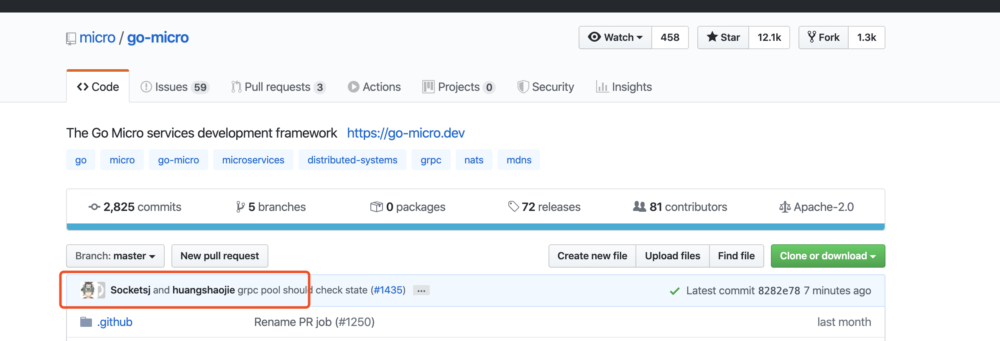

<meta name="referrer" content="no-referrer" />

## 背景
  线上服务使用go-micro框架，一次修复线上bug热更某个服务节点重启时，发现重启后访问该服务都会出现少量`grpc error`。导致重启后偶尔服务一小段时间服务不可用。

## 排查分析
  重启后服务一段时间不可用，通过时间推断确定是重启后出现服务不可用。怀疑是grpc call某个地方出现问题。发现grpc call时候会先从grpc链接池取出grpc链接，使用该grpc链接来进行请求。重启服务后，原来链接该服务的grpc链接可能已经失效。
  
  找出取grpc conn的代码加上log, 发现当错误出现时候grpc conn的状态是`TRANSIENT_FAILURE`
  ```go
  cc, err := g.pool.getConn(address, opts...)
  log.Debugf("grpc state", cc.GetState())
  ```
  
  可以确定是从grpc pool中取出的链接是无效的。因为服务重启后使用的还是原来的`addr:port`, 请求端从etcd获取到注册的`addr:port`还是原来的。会从grpc pool取出之前的无效链接。

## grpc state
 需要分析为什么会出现`TRANSIENT_FAILURE`,grpc每个状态代表什么意思。
 
 - CONNECTING: 代表链接刚刚建立刚刚完成来tcp链接。链接初始建立的阶段。
 - READY: 链接已经建立好了可以开始服务了。
 - TRANSIENT_FAILURE: 在链接过程中出现socket错误或tcp链接三次握手中出现超时,这个时候会开始尝试重现链接最终会进入`CONNECTING`状态。
 - IDLE: 链接处于闲置状态,一般从`CONNECTING`状态进入或`READY`状态一个超时间内没有活跃grpc请求进入这个状态。
 - SHUTDOWN: grpc链接关闭，一般是接收到关闭链接请求或通信过程中出现不可修复的错误时候进入这个状态。
 
 每个状态转换图
 
 
 
 [相关文档](https://github.com/grpc/grpc/blob/master/doc/connectivity-semantics-and-api.md)
 
## 修复错误
 查看grpc_pool的内部实现, 链接池利用了grpc多路复用特性。多个请求可以复用同一个请求。限制过多请求使用同一个链接, 但是没有相关对应grpc state判断，也就是讲从grpc pool中取出的链接有可能是失效的。
 
 ```go
func (p *pool) getConn(addr string, opts ...grpc.DialOption) (*poolConn, error) {
	now := time.Now().Unix()
	p.Lock()
	sp, ok := p.conns[addr]
	if !ok {
		sp = &streamsPool{head: &poolConn{}, busy: &poolConn{}, count: 0, idle: 0}
		p.conns[addr] = sp
	}
	//  while we have conns check streams and then return one
	//  otherwise we'll create a new conn
	conn := sp.head.next
	for conn != nil {
		//  a old conn
		if now-conn.created > p.ttl {...}
		//  a busy conn
		if conn.streams >= p.maxStreams {...}
		//  a idle conn
		if conn.streams == 0 {...}
		//  a good conn
		conn.streams++
		p.Unlock()
		return conn, nil
	}
	p.Unlock()

	//  create new conn
	cc, err := grpc.Dial(addr, opts...)
	if err != nil {
		return nil, err
	}
	conn = &poolConn{cc, nil, addr, p, sp, 1, time.Now().Unix(), nil, nil, false}

	//  add conn to streams pool
	p.Lock()
	if sp.count < p.size {
		addConnAfter(conn, sp.head)
	}
	p.Unlock()

	return conn, nil
}
 ```
 
  针对这种情况添加添加检查state相关代码
  
  ```go
  	for conn != nil {
		//  check conn state
		// https://github.com/grpc/grpc/blob/master/doc/connectivity-semantics-and-api.md
		switch conn.GetState() {
		case connectivity.Connecting:
			conn = conn.next
			continue
		case connectivity.Shutdown:
			next := conn.next
			if conn.streams == 0 {
				removeConn(conn)
				sp.idle--
			}
			conn = next
			continue
		case connectivity.TransientFailure:
			next := conn.next
			if conn.streams == 0 {
				removeConn(conn)
				conn.ClientConn.Close()
				sp.idle--
			}
			conn = next
			continue
		case connectivity.Ready:
		case connectivity.Idle:
		}
		....
    }
  ```
  
  修改后本地重现服务重启，再也没有出现重启一段时间后偶尔无法访问的情况。针对这个修改给`go-micro`团队提出了pull request
 
  没想到Asim大佬这么快就merge了我的request
  
  
  
  
  
  从此世界留下了我的足迹！！！！！

  
  