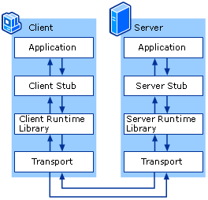
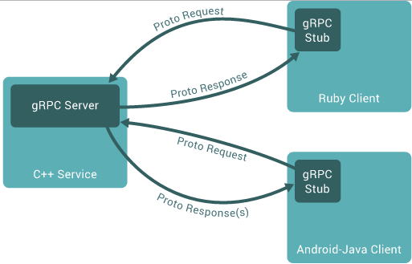

<meta name="referrer" content="no-referrer" />

 grpc是rpc框架的一种，定义了远程方法调用的方式。最近总结学习了一些关于grpc的知识，从rpc开始切入，写下这篇文章。

# RPC
 rpc是远程过程调用(Remote Procedure Call，缩写为 RPC)。是一种计算机通信协议，该协议允许运行于一台计算机的程序调用另一台计算机的子程序，而程序员无需额外地为这个交互作用编程。 如果涉及的软件采用面向对象编程，那么远程过程调用亦可称作远程调用或远程方法调用

 
 
 上图为rpc调用过程, RPC 本身是 client-server模型,也是一种 request-response 协议。不同的rpc框架本质都是客户端发起请求，服务器作出响应。
 
 服务的调用过程为：
 1. client调用client stub，这是一次本地过程调用
 2. client stub将参数打包成一个消息，然后发送这个消息。打包过程也叫做 marshalling
 3. client所在的系统将消息发送给server
 4. server的的系统将收到的包传给server stub
 5. server stub解包得到参数。 解包也被称作 unmarshalling
 6. 最后server stub调用服务过程. 返回结果按照相反的步骤传给client

 RPC只是描绘了 Client 与 Server 之间的点对点调用流程，包括 stub、通信、RPC 消息解析等部分，在实际应用中，还需要考虑服务的高可用、负载均衡等问题，所以产品级的 RPC 框架除了点对点的 RPC 协议的具体实现外，还应包括服务的发现与注销、提供服务的多台 Server 的负载均衡、服务的高可用等更多的功能。 目前的 RPC 框架大致有两种不同的侧重方向，一种偏重于服务治理，另一种偏重于跨语言调用。

# gRPC
 gRPC就是一种偏向于跨语言调用的rpc框架，由Google开源。
## 概念
 一个客户端程序可以直接调用一个服务端程序中的方法，这个服务端程序可以是在另外一台机器上，调用起来就像它是一个本地对象，这就方便你创造分布式的应用和服务。
 
 
 
 正如需要RPC系统那样，gRPC的思想基础也是：定义一个服务，然后指定方法可以通过参数和返回类型，来远程调用它们。在服务端，程序实现这个接口，并且运行一个gRPC服务器来处理客户端调用。在客户端，有一个存根（stub，即为用任何语言写的客户端程序），它提供了和服务端相同的方法。

## 数据格式
 通信过程需要定义一种数据格式，比如json、xml等都是一种数据格式。grpc使用proto buffer，用来序列化结构化的数据。proto buffer也是Google的一个成熟开源框架。
 
 使用proto buffer，先定义.proto后缀的proto文件。proto buffer的数据被结构化为消息，每一个message都是一个小的逻辑记录，包含了一系列的被称为fields的name-value对信息。例如proto文件定义如下。
 
 ```
 message Person {
 	string name = 1;
     int32 id = 2;
     bool has_ponycopter = 3;
 }
 ```
 
 定义好proto文件后，使用``protoc``编辑器。生成对应编程语言的类文件如Python、Java和Golang等。然后就可以使用这个类反序列化和序列化进行grpc通信。
 
 ```
 // The greeter service definition.
 service Greeter {
   // Sends a greeting
   rpc SayHello (HelloRequest) returns (HelloReply) {}
 }
 
 // The request message containing the user's name.
 message HelloRequest {
   string name = 1;
 }
 
 // The response message containing the greetings
 message HelloReply {
   string message = 1;
 }
 ```
 
 gRPC还使用``protoc``和一个特殊的gRPC插件，从proto文件中生成代码。并且，通过gRPC插件，你可以得到生成的gRPC客户端和服务端代码，就像上面那样用来填充，序列化，和接收消息类型的规则protocol buffer代码一样。

## gRPC通信方法
### 一元RPC
 这是最简单的RPC类型，客户端向服务器发送一个单独请求，并且获取一个单一响应，就像一个普通的方法调用。
 - 当客户端调用本地对象stub上的方法时，服务端就会收到通知说RPC已经被调用，包含有这次调用的客户端元数据（metadata），方法名，还有指定的期限（deadline）如果可用。
 
 - 服务器可以选择直接发回它自己的初始元数据（必须在任何响应之前发送），或者等待客户端的请求消息 -- 先发生那种情况，由应用程序指定。
 
 - 一旦服务器有了客户端的请求消息，它就开始进行产生并填充响应的相关工作。响应随即被返回（如果成功）至客户端，包含了状态详情（状态码，和可选的状态消息），以及可选的拖尾元数据（trailing metadata）
 
 - 如果状态是OK，客户端会得到响应，然后由客户端这边完成本次调用。
 
 定义方式:
  ```
  rpc SayHello(HelloRequest) returns (HelloResponse){
  }
  ```
 
### 服务端流式RPC
 一个服务端流式RPC和我们的简单样例很相似，除了服务端在收到客户端请求消息后，返回一个响应流。当返回完它的所有响应后，服务端的状态详情（状态码，和可选的状态消息）以及可选的拖尾元数据会被返回，以此完成服务端部分的工作。而客户端一旦得到服务器的所有响应就会完成本次调用。
 
 定义方式
 ```
 rpc LotsOfReplies(HelloRequest) returns (stream HelloResponse){
 }
 ```

### 客户端流式RPC
 一个客户端流式RPC也和我们的例子很相似，除了客户端向服务器发送一个请求流，而不是一个单独请求。服务器返回一个单独响应，当服务器获取到客户端所有请求后，它一般都会在响应中，附带上状态详情和可选的拖尾元数据，但这不是必需的。
  
 定义方式
 ```
 rpc LotsOfGreetings(stream HelloRequest) returns (HelloResponse) {
 }
 ```

### 双向流式RPC

 在双向流式RPC中，也同样是客户端发起通信，调用方法，并且服务端接收客户端元数据，方法名，和期限。服务端也同样是可以选择发回它的初始元数据，或者是等待客户端开始发送请求。
 
 接下来发生什么取决于应用程序，由于客户端和服务器可以以任意顺序进行读写 -- 流操作是完全独立的。所以，举个例子，服务器可以等待直到它收到客户端的所有消息，然后开始写响应，或者服务器和客户端以打乒乓球的方式交流：服务器收到一个请求，然后发回一个响应，然后客户端基于响应再发起其它请求，以此类推
 ```
 rpc BidiHello(stream HelloRequest) returns (stream HelloResponse){
 }
 ```