<meta name="referrer" content="no-referrer" />

# 关于本文
  本文记录本人在搭建个人博客的一些经历，对0基础小白搭建个人博客提供技术指导。
 
# 原理
  这里简单介绍博客搭建起来原理，使用hexo生成博客静态页面。交由此外Github托管代理。这样给人博客就这样运行起来。

## hexo
  Hexo是一款基于Node.js的静态博客框架，依赖少易于安装使用，可以方便的生成静态网页托管在GitHub和Heroku上，是搭建博客的首选框架。
  
  Hexo同时也是GitHub上的开源项目，参见：hexojs/hexo 如果想要更加全面的了解Hexo，可以到其官网 Hexo 了解更多的细节。

## Github
  GitHub是一个面向开源及私有软件项目的托管平台，可以将你的代码即文档放在Github上托管。
  
  此外Github也是开发者交流平台，提供githubpage作为开发者个人展示页面。静态网页可以放在githubpage上运行

# 搭建准备
  前面废话那么多，只希望对hexo+github搭建个人博客有个大概认识。接下来按照下列指引做准备工作。

## Github账号
  首先要加入Github这个大家庭，登录[Github官网](https://github.com/),点击sign up加入Github大家庭.
 
  注册步骤比较简单(email+username+password), username比较重要取一个自己喜欢的名字，以后博客url会是http://username.github.io
  
  

## 安装git
  Github是以git作为版本库作为管理，进入[git官网](https://git-scm.com/downloads)下载git
  
  
  
  注意要安装选择wind command这样可以不需要git bash也可以运行git命令(因为git一开始是linux开发用对windows系统支持不好，才有gitbash)
  
  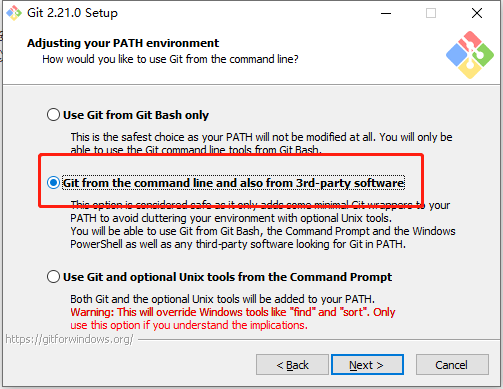
  
  选择openssl

  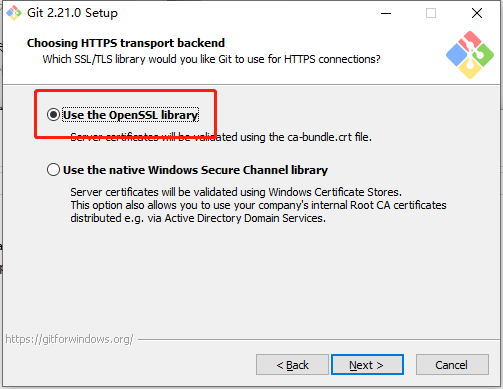

  安装成功后右键会有git bash，或进入cmd(win+r 输入cmd进入命令行)检查
  
  
  
  设置git账号和email，右键打开gitbash(防止某些功能不支持最好打开gitbash)
  
  ```
  # 设置全局用户名,写你创建github账号的username
  git config --global user.name "{username}"
  # 设置全局email,写你创建github的email
  git config --global user.email "{eamil}"
  ```

## 安装nodejs
  nodejs是一个可以执行js的web服务器，本地博客调试会在nodejs运行。
  
  windows系统安装nodejs比较简单， 进入[nodejs官网](https://nodejs.org/en/download/)
  
  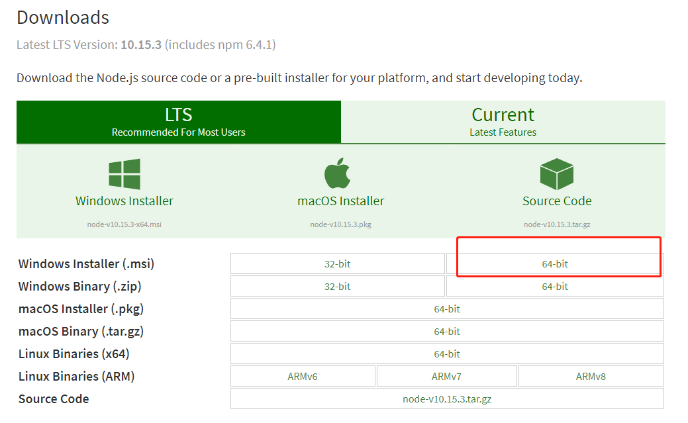
  
  检查node安装
  

# 安装hexo
 有以上准备后，可以开始安装hexo。

## 配置全局npm安装目录

### 查看npm配置
 安装好nodejs后一般默认全局安装目录在c盘下，最好修改一下
 
 ```
 # 查看npm设置
 npm config ls
 ```

### 设置npm全局安装目录
 一般最好在你安装nodejs的目录下设置全局安装目录,在nodejs安装目录下创建node_global和node_cache如下
 
 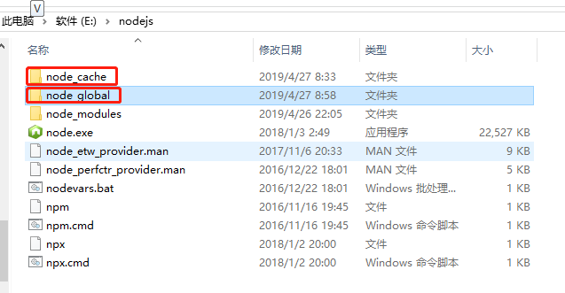
 
 ```
 # 设置全局目录
 # 需要写下你刚刚创建两个文件夹路径，以我nodejs安装路径是E:\nodejs\为例子
 # 设置全局安装路径
 npm config set prefix E:\nodejs\node_global
 # 设置安装缓存路径
 npm config set cache E:\nodejs\node_cache
 # 设置淘宝源解决国内下载问题
 npm config set registry https://registry.npm.taobao.org/
 ```

### 为npm全局目录添加环境变量
  右键我的电脑，选择属性，选择高级系统设置，选择环境变量，在系统变量中找到变量名字为Path的属性点击编辑，点击新建输入上面设置全局变量的路径
  
  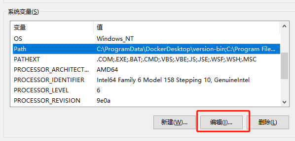
  
  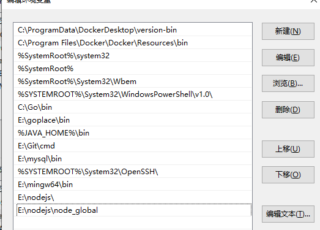
  
  设置好环境变量后之前打开的命令行需要关闭重新打开
  
## cnpm
 hexo可以通过npm安装，但国外源需要翻墙下载，即使使用淘宝源也很慢。(如有翻墙可以跳过这步,以后步骤若有cnpm的可以直接用npm)
 
 ```shell
 # 通过npm安装cnpm，这里可能比较慢耐心等候
 npm install -g cnpm --registry=https://registry.npm.taobao.org
 ```
 
 检查cnpm安装
 
 
 
## hexo安装
 在上面安装好cnpm后可以通过cnpm安装hexo，若不需要cnpm直接使用npm
 
 ```shell
 # 安装hexo
 cnpm install -g hexo
 ```
 
 安装成功后输入hexo -v检查安装
 
 

# Github仓库
## 新建Github仓库
  博客静态页面需要存放在Github仓库中托管，登录[github](https://github.com/), 点击创建仓库
  
  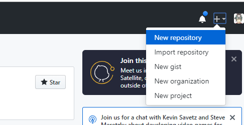
  
  仓库名字是你注册github时候的username.github.io,  注意一定要替换成你自己username
  
  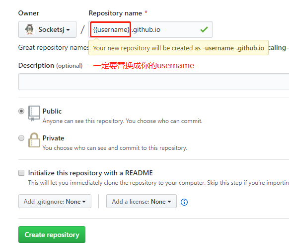
  
  若忘记username，点击github你个人头像向下箭头，查看username
  
  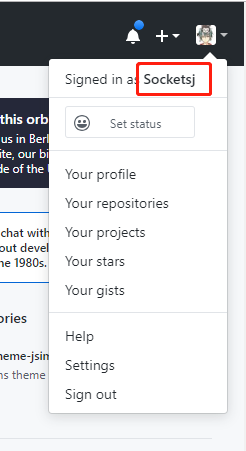
  
## 查看仓库
  创建完仓库会进入如下页面，这里熟悉一下Github仓库
 
  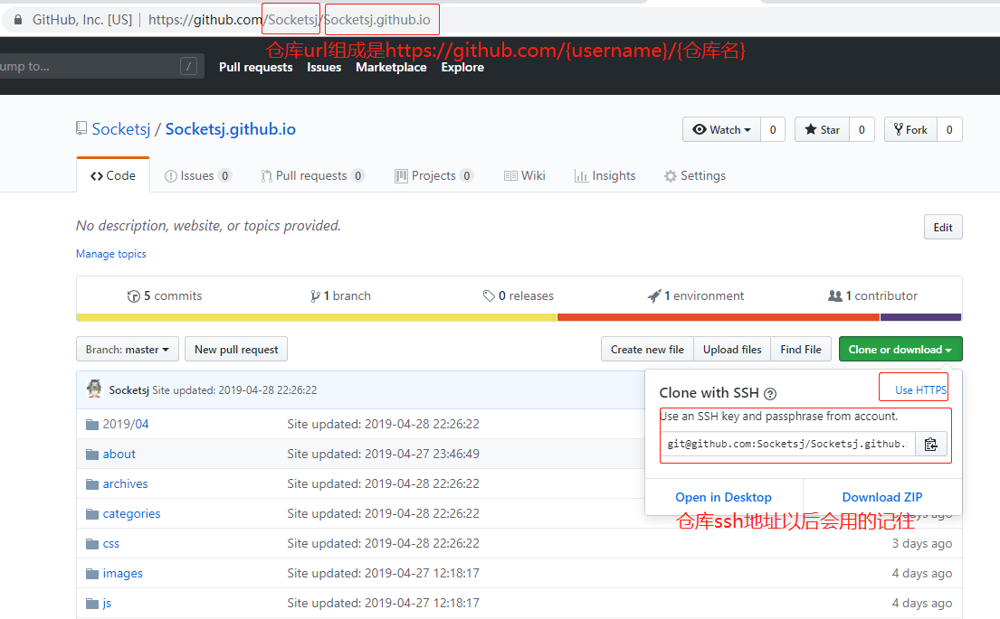

## Github Page
  仓库页面中点击setting
  
  
  
  找到Github Page， 点choose themes随便选一个主题，之后会有一个url，这个就是你博客的url了
  
  
  

## SSH key
  一般使用git传输账号和密码是不建议用(比较麻烦以及安全问题)，使用SSH(一种非对称加密方法)作为验证
### 生成SSH key
  SSH key成对出现，分为公钥和私钥。公钥加密内容只能由私钥解密，github服务器存放公钥，pc持有私钥。验证过程即服务器通过公钥加密一些内容，用户使用私钥解密信息。
  
  右键打开gitbash
  
  ```shell
  ssh-keygen -t rsa -C "your_email@example.com"
  ```
  
  参数解析
  
  -t 指定密钥类型，默认是 rsa ，可以省略。
  
  -C 设置注释文字，比如邮箱。
  
  -f 指定密钥文件存储文件名。
  
  由于上面省略了参数会要你输入文件名，可以不输入继续按回车键，最后会在当前目录下生成id_rsa 和 id_rsa.pub 两个秘钥文件
  
  进入系统用户目录windows一般在C:\Users\Administrator目录,linux系列在~/目录下，查看有无.ssh文件夹若没有创建一个
  
  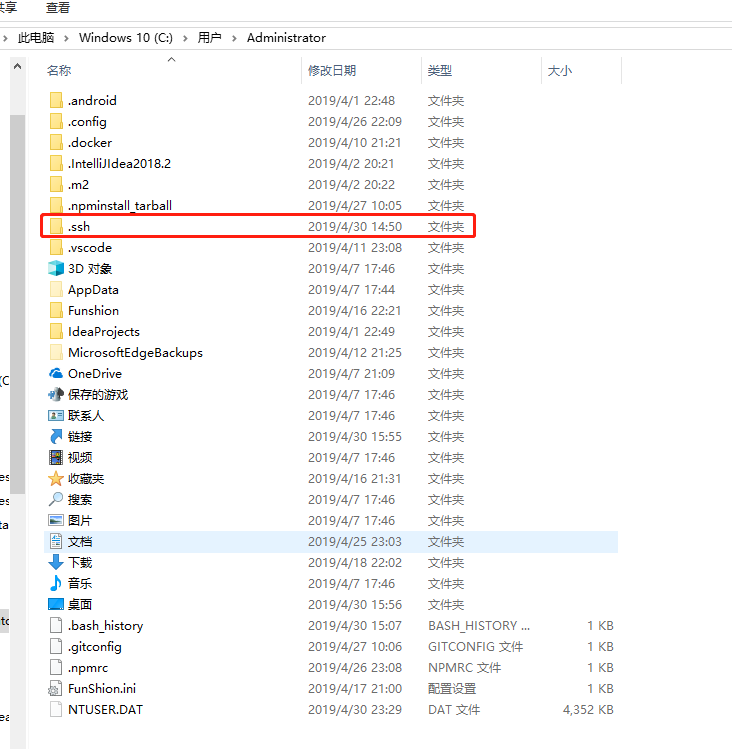
  
  把生成的两个密钥文件复制到.ssh文件夹里面
  
  

### 设置SSH key
  点击头像向下箭头，点setting
  
  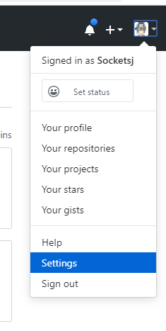
  
  点击new SSH key
  
  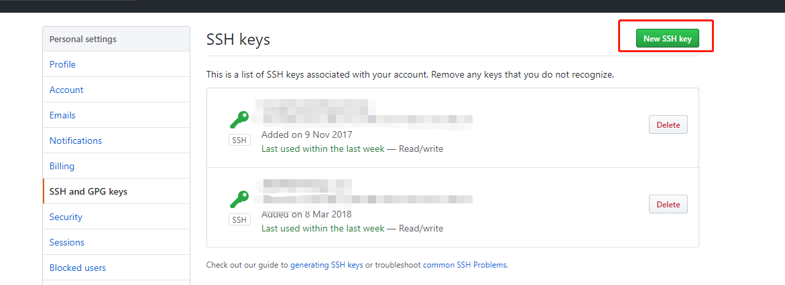
  
  title写这个ssh key的描述一般写你生成key的email， 打开生成密钥文件的id_rsa.pub文件，把文件内容复制到key,点击add ssh key 添加
  
  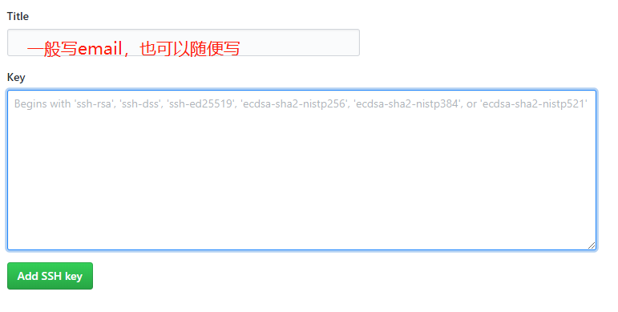
  
### 测试 SSH key
  成功生成和添加SSH key后可以测试一下以上步骤是否有效
  
  在gitbash中输入
  
  ```
  ssh -T git@github.com
  ```
  
  第一次SSH登录会有告警信息，直接按回车就可以
  
  ```
  The authenticity of host 'github.com (207.97.227.239)' can't be established.
  # RSA key fingerprint is 16:27:ac:a5:76:28:2d:36:63:1b:56:4d:eb:df:a6:48.
  # Are you sure you want to continue connecting (yes/no)?
  ```
  
  成功会有一下提示
  
  ```
  Hi username! You've successfully authenticated, but GitHub does not
  # provide shell access.
  ```

# hexo使用
  有了以上步骤后，一起都准备就绪，接下来使用hexo构建博客内容
## hexo初始化
  选择一个目录，这里将要作为构建你的博客工作目录，创建一个新的文件夹，进入该文件夹
  ```
  # 输入hexo init 进行初始化
  hexo init
  ```
  
  初始化后目录会如下
  
  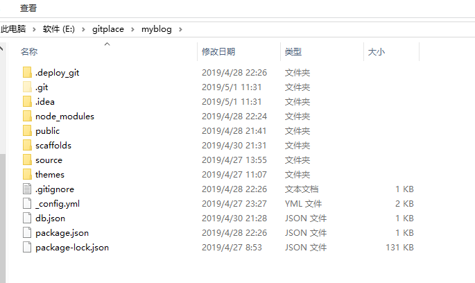
  
  - node_modules 存放hexo依赖
  - public 博客生成的静态文件存放在这里
  - scaffolds 博客md模板文件
  - source 博客文章文件，主要在这个目录下编写文章
  - themes 博客主题 
  - _config.yml 博客配置信息，个人信息已经博客相关设置在这里

## hexo配置
  打开_config.yml文件
  
  设置站点信息
  
  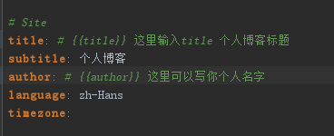
  
  这里是设置主题，可以不改
  
  
  
  找到deployment，设置发布内容，这里将上面创建仓库的ssh地址复制进去
  
  

## hexo指令
  这里介绍一下hexo命令
  ```
  hexo g 
  # 生成博客静态文件，在public目录下可以看到博客的静态html文件
  hexo s
  # hexo server模式， 在浏览器输入localhost:4000可以在本地看到你的博客
  hexo d
  # 把博客发布到网上
  hexo n '{文章标题}'
  # 生成文章会在source/_post/下
  ```
## 本地调试
  博客工作目录下右键打开gitbash(简单快捷的方式在此目录下打开命令行)
  
  输入hexo s， 打开[http://localhost:4000](http://localhost:4000)
  
  可以看到如下，以后添加文章调试可以用这样方式
  
  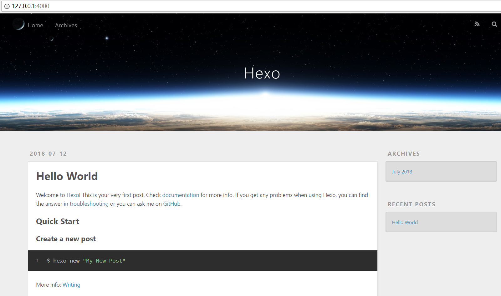

## 新建文章
  hexo的博客文章，是用markdown(简称md)格式写。hexo会根据编写的md文件生存博客静态文件。不熟悉可以看[md教程](http://www.markdown.cn/)
  
  输入hexo n ‘文章标题’新建文章，然后会在source/_post/下生存一个md文件，下面我用example作为例子
  
  
  
  在source/_post目录下会看到多了example.md文件
  
  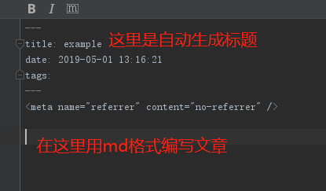

## 发布博客
  如果想让别人通过互联网也能看到你的博客，可以使用发布命令吧博客发布到githubpage上。
  
  在发布前需要安装git发布的相关依赖，在博客工作目录下打开gitbash
  
  ```
  cnpm install hexo-deployer-git --save
  ```
  
  编译&发布
  
  ```
  #编译生成博客静态文件
  hexo g 
  #发布
  hexo d
  ```

  这样就可以登录https://{username}.github.io 打开你的个人博客了
  
# 总结
 这票文章可能写的比较啰嗦，主要是没有接触过git、github和node的同学介绍。图文比较多，如果想修改主题，后面我加一篇关于hexo主题的文章

