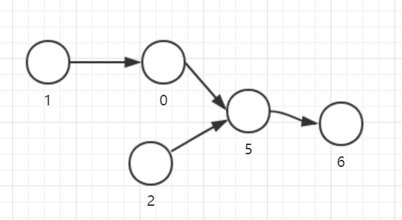
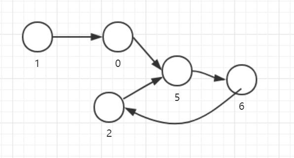
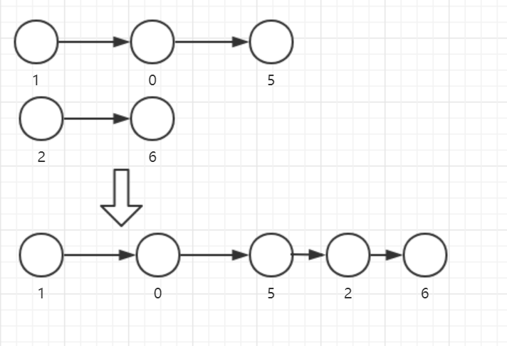
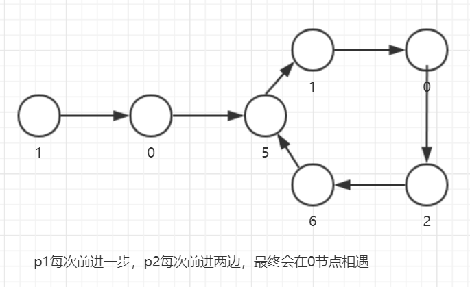

<meta name="referrer" content="no-referrer" />

这一题是leetcode160题。关于链表的一道easy题。

今天之所以会写下关于这题的文章， 因为要做好这题还是有两个窍门。

所以我觉得这题并不easy

## 题目描述

编写一个程序，找到两个单链表相交的起始节点。

如下面的两个链表：


在节点 c1 开始相交。

*示例 1：*


```
输入：intersectVal = 8, listA = [4,1,8,4,5], listB = [5,0,1,8,4,5], skipA = 2, skipB = 3
输出：Reference of the node with value = 8
输入解释：相交节点的值为 8 （注意，如果两个列表相交则不能为 0）。从各自的表头开始算起，链表 A 为 [4,1,8,4,5]，链表 B 为 [5,0,1,8,4,5]。在 A 中，相交节点前有 2 个节点；在 B 中，相交节点前有 3 个节点。
```

*示例 2：*


```
输入：intersectVal = 2, listA = [0,9,1,2,4], listB = [3,2,4], skipA = 3, skipB = 1
输出：Reference of the node with value = 2
输入解释：相交节点的值为 2 （注意，如果两个列表相交则不能为 0）。从各自的表头开始算起，链表 A 为 [0,9,1,2,4]，链表 B 为 [3,2,4]。在 A 中，相交节点前有 3 个节点；在 B 中，相交节点前有 1 个节点。
```

*示例 3：*


```
输入：intersectVal = 0, listA = [2,6,4], listB = [1,5], skipA = 3, skipB = 2
输出：null
输入解释：从各自的表头开始算起，链表 A 为 [2,6,4]，链表 B 为 [1,5]。由于这两个链表不相交，所以 intersectVal 必须为 0，而 skipA 和 skipB 可以是任意值。
解释：这两个链表不相交，因此返回 null。
```

*注意：*

- 如果两个链表没有交点，返回 null.
- 在返回结果后，两个链表仍须保持原有的结构。
- 可假定整个链表结构中没有循环。
- 程序尽量满足 O(n) 时间复杂度，且仅用 O(1) 内存。

## 暴力解法

### 双循环

这题有一个最直接简单的方法，遍历一个链表的所有节点。判断该节点在另一个链表中是否存在

时间复杂度: O(n²)

空间复杂度: O(1)

### 映射

先遍历一个链表，把链表的所有节点存储在一个map或set中。遍历第二个链表，判断节点是否在map中

时间复杂度: O(n)

空间复杂度: O(1)

## 最优解法

那么有没一种最优解法，让空间复杂度为O(1),时间复杂度为O(n)。我可以很肯定地说有

看下面这个例子，如果把节点6和节点2连在一起，是不是形成一个环了



若有相交点则形成一个带环的链表如下



若无相交点则会形成一个新的链表



那么现在问题从求相交节点变成了求带环链表的入环节点(就是进入环的节点)

## 是否带环

如果两个链表没有相交节点，经过上面操作后是不会带环的。

那么如何判断一个未知长度的链表是否带环尼

一个笨方法在链接链表前算两个链表长度，然后遍历带环链表如果经历节点数量大于两个链表长度总和，那一定是带环

这里判断是否带环是用了快慢指针

一个带环的链表不管环有多大。一个指针每次前进两步，另一个每次前进一步，那么他们一定会在环中再相遇。



## 求入环节点

这里是关键部分了，求入环节点。上面我们可以知道快慢指针的相遇节点，我们可以利用快慢指针特性求入环节点。

根据上图做出一下推理

```
设入环前长度d，入环后到相遇节点长度m，环长度s，快指针相遇时候在环转了n圈
快指针走的距离 = d + m + n * s
慢指针走的距离 = d + m
因为快指针每次比慢指针快一步所以
2 * (d + m) = d + m + n * s
得 d + m = n * s
```

由上面推论得也就是说走到相遇节点的距离，等于在环中转n圈。

那么在快慢指针相遇的节点开始转n圈的步数是等于从头节点走到相遇节点的步数

由此很清晰明了，两个指针，一个指针在相遇节点开始，另一个从头节点开始每次一步前进。两指针相遇的节点一定是入环节点

如果还不明白的可以看下图


## 代码实现

这里用我比较熟悉的golang编写，48ms

```go
/**
 * Definition for singly-linked list.
 * type ListNode struct {
 *     Val int
 *     Next *ListNode
 * }
 */
func getIntersectionNode(headA, headB *ListNode) *ListNode {
    if headA == nil || headB == nil {
        return nil
    }
    var p, q *ListNode
    // 找出尾巴节点
    p = headA
    for p.Next != nil {
        p = p.Next
    }
    // 尾巴节点和另一个头部节点相连
    // 1. 如果形成环则是有相交点，找出相交点
    // 2. 反之则无相交节点
    p.Next = headB
    defer func(end *ListNode){
       end.Next = nil 
    }(p)
    p, q = headA, headA
    // q前进一步, p一次前进两步
    // 任一个为空代表链表没有成环
    for p != nil && p.Next != nil {
        p = p.Next.Next
        q = q.Next
        if p == q {
            // 寻找相交节点
            p = headA
            for p != q {
                q = q.Next
                p = p.Next
            }
            return q
        }
    }
    return nil
}
```