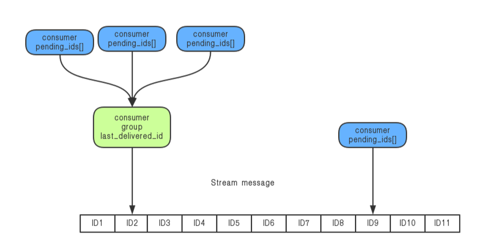
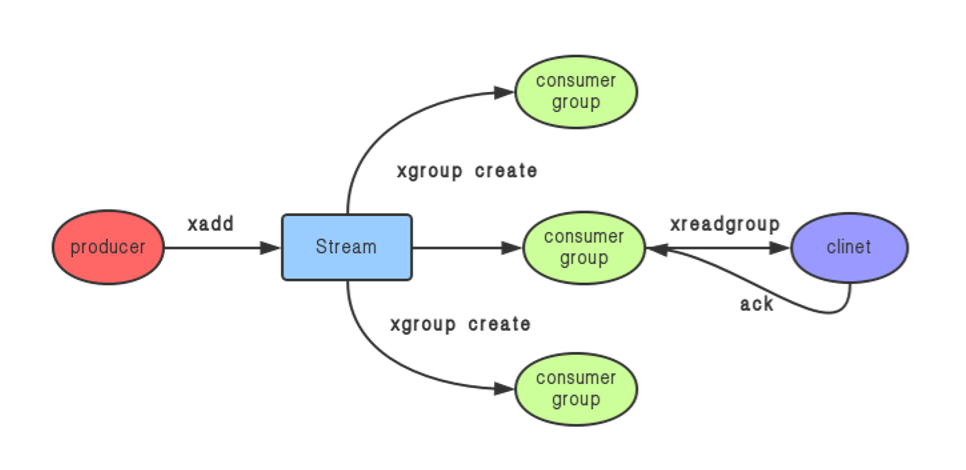

<meta name="referrer" content="no-referrer" />

 Redis5.0发布了一个新特性功能。多了一种数据结构名为Stream,它是一个新的强大的支持多播的可持久化消息队列，作者坦言Stream设计极大借鉴了Kafka。比起以前的sub/pub可靠谱多了。

# Redis Stream



 Redis Stream的结构如图所示，它有一个消息链表，将所有加入的消息都串起来，每个消息都有对应id和内容，id是自增的，消息是持久化的，Redis重启，内容还能保存。
 
 每个Stream都有唯一的key，可以挂在多个消费组，每个消费组可以挂多个消费者。
 
 消费组存有一个游标值last_delivered_id记录消费到那个消息。每个消费组之间互不干涉，消费组内消费者存在竞争关系，消费组内消费者消费时会跟新游标值（这一点和Kafka很相似）。
 
 消费者可以直觉不通过消费组直觉挂在消息上，如果这样做客户端处理需要自己记录消费游标。消费者内部pending_ids变量，记录所有被读取都是消费者没有ack的消息id。若消费者ack会从该变量中抹去这个id。
 
# 消息
## 消息ID
 消息ID是一个自增的值，生成公式如下
 ```
 id = timestampInMills + '-' + squence
 timestampInMills: 当前时间戳毫秒数
 squence: 为同一个时间内产生的第几个消息
 如: 1558191173977-5,是时间戳1558191173977生成的第6个消息(从0开始)
 ```
 
## 消息内容
 消息内容是一个键值对，形如hash结构的键值对
 
## 消息命令
 - xadd: 向Stream追加信息，若Stream为空创建Stream
 - xdel: 后面带消息ID，删除Stream中该消息ID的消息
 - xtirm: 一般用法 xtrim {stream_name} maxlen {len} 来现在Stream最大消息数
 - xrange: 获取Stream中消息列表,会自动过滤已经删除的消息
 - xlen: 获取Stream中消息长度
 - xinfo: 获取Stream信息
 - del: 把Stream中所有消息清空并删除
 
 ```
 redis-cli -p 6380
 # * 代表服务器自动生成的消息id，也可以自己指定id但必须是递增
 127.0.0.1:6380> xadd topic * id 464 name xiaoming
 "1558191173977-0" # 返回的消息id
 127.0.0.1:6380> xadd topic * id 465 name xiaohong
 "1558192024278-0" # 返回的消息id
 127.0.0.1:6380> xadd topic * id 466 name xiaolei
 "1558192031831-0" # 返回的消息id
 127.0.0.1:6380> xlen topic
 (integer) 3 # 消息长度
 # -代表消息id最小值 +代表消息id最大值
 127.0.0.1:6380> xrange topic - +
 1) 1) "1558191173977-0"
    2) 1) "id"
       2) "464"
       3) "name"
       4) "xiaoming"
 2) 1) "1558192024278-0"
    2) 1) "id"
       2) "465"
       3) "name"
       4) "xiaohong"
 3) 1) "1558192031831-0"
    2) 1) "id"
       2) "466"
       3) "name"
       4) "xiaolei"
 # 查看Stream信息
 127.0.0.1:6380> xinfo stream  topic
  1) "length"
  2) (integer) 3
  3) "radix-tree-keys"
  4) (integer) 1
  5) "radix-tree-nodes"
  6) (integer) 2
  7) "groups"
  8) (integer) 0
  9) "last-generated-id"
 10) "1558192031831-0"
 11) "first-entry"
 12) 1) "1558191173977-0"
     2) 1) "id"
        2) "464"
        3) "name"
        4) "xiaoming"
 13) "last-entry"
 14) 1) "1558192031831-0"
     2) 1) "id"
        2) "466"
        3) "name"
        4) "xiaolei"
 ```

## 消息长度
 消息若是被一直添加，会积累太多，Stream的消息链表会越积越长。同时上面提供的xdel指令不会真正删除消息，只是标记删除。
 
 Redis提供两种方法现在长度xtirm和xadd的指令中提供maxlen参数，这样可以控制消息长度不会超过最大指定长度

# 消费


 上图是Redis Stream的消费模型，Prouder通过xadd命令往Stream中添加消息。使用xgroup create在Stream上创建对应Consumer Group。消费者使用xreadgroup命令挂在消费组上进行消费，然后xack命令标记消息消费过。
## 独立消费
 上面说过，一个消费者是可以不挂在消费组中，直接挂在Stream上进行独立消费的。Redis使用xread指令，来进行独立消费，这样看起来好像在使用list结构一样
 ```
 # 从Stream 头部读取一条消息
 # 命令格式为 xread + count + 读取消息数 + streams + stream name + 开始消息id值 0-0代表从Stream第一个值开始
 127.0.0.1:6380> xread count 1 streams topic 0-0
 1) 1) "topic"
    2) 1) 1) "1558191173977-0"
          2) 1) "id"
             2) "464"
             3) "name"
             4) "xiaoming"
 # 从尾部读取一条消息, $代表消息id最后的一个值
 127.0.0.1:6380> xread count 1 streams topic $
 (nil) # 毫无疑问这里一定会返回空的
 # 可以阻塞读方式，直到有新的消息加入就会返回 1000 代表阻塞1s
 127.0.0.1:6380> xread block 1000 count 1 streams topic $
 ```
## 创建消费组
 Redis提供xgroup指令创建消费组，创建消费组需要提供起始的消息id初始化last_delivered_id变量。其中0-0代表从第一个消息开始消费，$代表从尾部开始消费
 
 ```
 # 创建从消息头部开始消费的消费组
 127.0.0.1:6380> xgroup create topic group 0-0
 OK
 # 创建从尾巴开始消费的消费组
 127.0.0.1:6380> xgroup create topic group2 $
 OK
 127.0.0.1:6380> xinfo stream topic
  1) "length"
  2) (integer) 3
  3) "radix-tree-keys"
  4) (integer) 1
  5) "radix-tree-nodes"
  6) (integer) 2
  7) "groups"
  8) (integer) 2 # 两个消费组
  9) "last-generated-id"
 10) "1558192031831-0"
 11) "first-entry"
 12) 1) "1558191173977-0"
     2) 1) "id"
        2) "464"
        3) "name"
        4) "xiaoming"
 13) "last-entry"
 14) 1) "1558192031831-0"
     2) 1) "id"
        2) "466"
        3) "name"
        4) "xiaolei"
 # 查看创建的消费组信息
 127.0.0.1:6380> xinfo groups topic
 1) 1) "name"
    2) "group"
    3) "consumers"
    4) (integer) 0
    5) "pending"
    6) (integer) 0
    7) "last-delivered-id"
    8) "1558191173977-0"
 2) 1) "name"
    2) "group2"
    3) "consumers"
    4) (integer) 0
    5) "pending"
    6) (integer) 0
    7) "last-delivered-id"
    8) "1558192031831-0"
 ```
 
## 从消费组消费 
 Stream提供了xreadgroup命令可以进行消费组内消费，需要提供消费组名称、消费者名称和起始的消费ID，也可以阻塞等待新消息。
 
 读到消息后，对应的消息id会进入到消费者的pending_id列表中，客户端处理完消息后使用xack命令通知服务器，本条消息处理完，该消息会从pending_id中删除。
 
 ```
 # > 代表从last_delivered_id开始读
 127.0.0.1:6380> xreadgroup GROUP group consumer count 1 streams topic >
 1) 1) "topic"
    2) 1) 1) "1558191173977-0"
          2) 1) "id"
             2) "464"
             3) "name"
             4) "xiaoming"
 # 查看对应消费者信息
 127.0.0.1:6380> xinfo consumers topic group
 1) 1) "name"
    2) "consumer"
    3) "pending"
    4) (integer) 1 # 有一个处于pending状态的消息
    5) "idle"
    6) (integer) 223838
 # ack已经读取的消息
 127.0.0.1:6380> xack topic group 1558191173977-0
 (integer) 1
 127.0.0.1:6380> xinfo consumers topic group
 1) 1) "name"
    2) "consumer"
    3) "pending"
    4) (integer) 0
    5) "idle"
    6) (integer) 333581
 ```
## ack机制
 Stream的每个消费者都保存了正在处理的消息ID pending_id,如果消费者收到了消息，但是一直没有ack，会导致pending_id的长度越来越长。
 
 Stream可以保证每一个消息都至少被消费一次。如果客户端在消费过程中突然中断连接，那么这个消息可能丢失了，但是pending_id保存了没有ack的消息id，当客户端重新连上读取消息时，会优先把pending_id中消息读取出来。
 ```
 # 读取一条消息，不ack后退出
 127.0.0.1:6380> xreadgroup GROUP group consumer count 1 streams topic >
 1) 1) "topic"
    2) 1) 1) "1558192024278-0"
          2) 1) "id"
             2) "465"
             3) "name"
             4) "xiaohong"
 127.0.0.1:6380> xinfo consumers topic group
 1) 1) "name"
    2) "consumer"
    3) "pending"
    4) (integer) 1
    5) "idle"
    6) (integer) 12879
 127.0.0.1:6380> exit
 # 将消息id参数设置为0-0，表示读取没有处理的消息以及从last_delivered_id开始读取
 127.0.0.1:6380> xreadgroup GROUP group consumer count 1 streams topic 0-0
 1) 1) "topic"
    2) 1) 1) "1558192024278-0"
          2) 1) "id"
             2) "465"
             3) "name"
             4) "xiaohong"
 ```

# 小结
 Stream的消费模型借鉴了Kafka的消费分组概念，弥补了Redis PubSub不能持久化消息的缺陷。Stream又不同于Kafka，Stream没有分区概念，Stream消息长度控制只能做在长度控制，不能按时间控制长度。总得来说Stream是一个可以提供简单功能的消息中间件