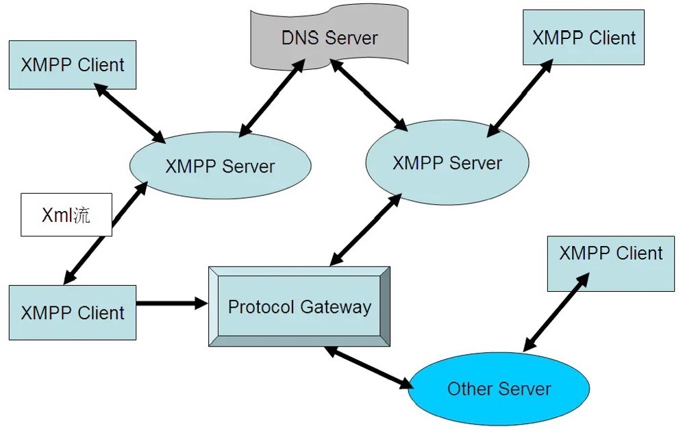
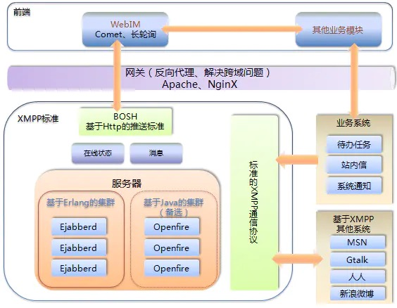
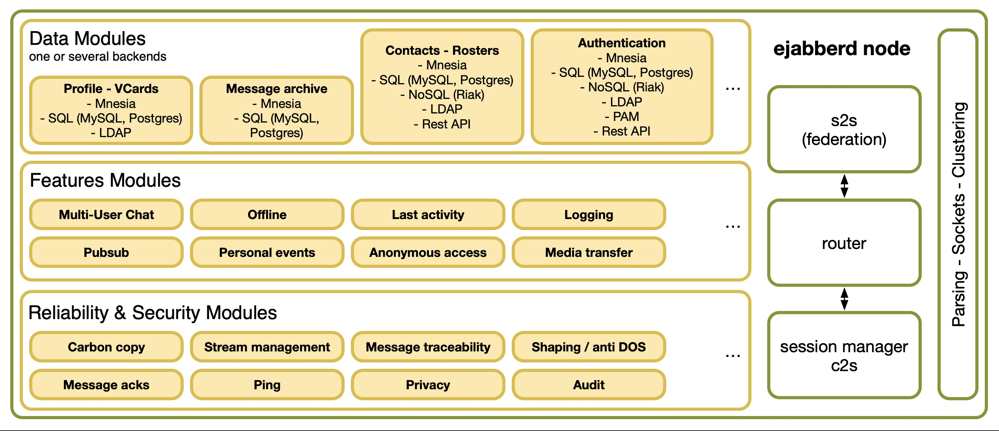
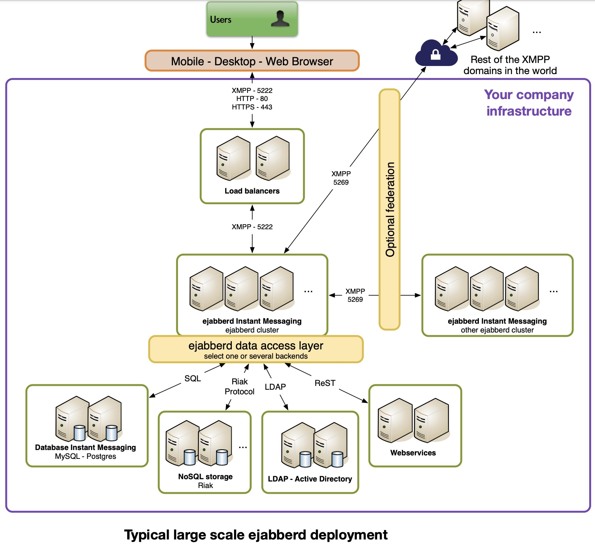
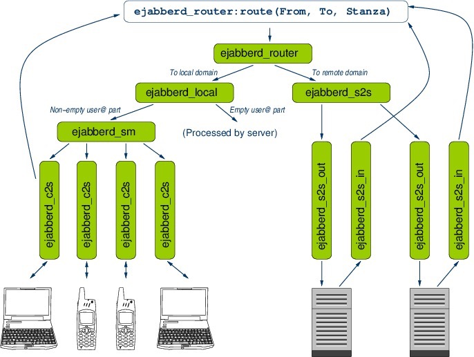

<meta name="referrer" content="no-referrer" />

# 前言
 前一段时间，做了关于XMPP协议及ejabberd的调研，调研IM系统的一个主流协议。写以下XMPP的介绍和ejabberd的介绍。

# XMPP
 XMPP协议（Extensible Messaging and PresenceProtocol，可扩展消息处理现场协议, 基于XML）是一系列的开源技术用于即时通讯、表示呈现、多方聊天、音频和视频通话、协作、轻量级中间组件、内容聚合和xml数据通用路由。
 
## XMPP的优点
 
 - 方便拓展,继承自XML的优势，可以很方便进行拓展。
 - 标准化,IETF组织已经标准化核心的xml流协议(RFC 6120, RFC 6121, and RFC 7622).
 - 协议成熟,XMPP目前被IETF国际标准组织完成了标准化工作。
 - 丰富的拓展协议,因其方便拓展。有丰富的拓展协议支持不同的功能.
 - 安全,SASL 和 TLS安全协议已经被规范到xmpp协议当中了

## XMPP通信网络结构
 XMPP的网络结构是C/S结构。客户端通过服务端和其他客户端来进行通信，而不是P2P方式(有其他拓展协议可以支持P2P)。XMPP中定义了三个角色，客户端，服务器，网关。通信能够在这三者的任意两个之间双向发生。服务器同时承担了客户端信息记录，连接管理和信息的路由功能。网关承担着与异构即时通信系统的互联互通，异构系统可以包括SMS（短信），MSN，ICQ等。基本的网络形式是单客户端通过TCP/IP)连接到单服务器，然后在之上传输XML。
 
 > XMPP网络结构图
 
 
 > XMPP和其他系统互联通信架构
 
 
 > XMPP具体通信过程
 
 
## XMPP属性概念

 - JID: 在XMPP网络上，每一个实体都有一个JID标识，JID是一组排列好的元素，包括域名（domain identifier），节点名（node identifier），和资源名（resource identifier）。比如一个jid: jid = user@xy163.com/iphone, 这里表示用户名是user,服务器域名是xy163.com,用户资源名为iphone。
 - full JID: 代表一个完整的JID与之对应是bare JID。full JID是包含node,domain和resource.  
 - bare JID: 和full JID对比缺少资源名，一般在用户向一个用户第一次发聊天信息的时候会带bare JID之后服务器会查找出full JID。以后聊天发言尽量传full JID减少服务器查找耗时。
 - node: 是对用户的抽象，既可以代表一个真实的用户，也能表示一个虚拟用户如一个聊天室等。
 - domain: 也可以叫host,代表的一个XMPP服务器的集群。
 - resource: 它通常表示一个特定的会话，连接。对于服务器和和其他客户端来说，资源名是不透明的。一般来说资源是用户使用的设备名加随机码。资源可以代表用户的一个终端链接。
 - stanzas: 是xml的标签，一般来说有三种, `#message`(用于聊天传消息)、`#presence`(用于用户状态)和`#iq`(用于增删查改)

## XML协议
XMPP的协议，首先以<stream></stream>标签作为根节点，流的生命周期：标签的开头即是流的开始，标签的关闭即是流的结束。在stream标签中，数据通过其内部的子标签(message、presence、iq等)当做数据实体，通过子标签可以定义大量的数据。

### 1.presence
 presence节点本身表示通知服务器自己的状态，用来控制和表示实体的在线状态，包含：离线(away)、在线()、离开、不能打扰等复杂状态，另外，还能白用来创建和结束在线状态的监听/订阅。

### 2.message
 限定消息推送到聊天对话或多用户聊天室的消息实体。
 
 主要属性
 
 | 属性    | 说明 |
 | ------- | -------- |
 |  from      |  消息发送者的full JID       |
 |  to     | 消息接收者JID,一般第一次是不知道full JID,填写bare JID。以后通信尽量写full JID|
 |  id    |  定义接收实体的id，具有唯一性。可以代表一次会话。类比于lobby中rpcid|
 |  type  |  聊天类型,普通的两人聊天是chat, 通过拓展协议可以支持group chat多人聊天 |
 |  version | 协议版本  |
 |  xml:lang | 用于实现国际化的属性，表示发送的XML字符所使用的语言。|
 
 子标签
 
 - \<subjetc/\> 表示一个消息体的主题内容，通常在聊天窗口标题处。
 - \<body/\> 聊天信息的内容
 - \<thread/\> 用于跟踪一个会话，该元素主要用于客户端实现消息展示（例如：消息历史查询时，每次会话折叠显示消息），每次会话会产生一个唯一的thread.id，xmpp推荐采用uuid算法
 - \<delay/\> 表示该消息是一个离线信息。delay会带消息发送时间和接收时间
 
 例子: userA给userB发一个消息
 ```xml
<message
    to='userAt@example.com/iphone'
    from='userB@example.com'
    type='chat'
    xml:lang='en'>
  <body>Hello</body>
  <thread>e0ffe42b28561960c6b12b944a092794b9683a38</thread>
</message>
 ```
### 3. iq
 iq节点主要是用于Info/Query模式的消息请求，类似于HTTP的get/post请求，可以发出get以及set请求，期望有返回值(有result,error两种回应)。
 
 type属性值：
 - Get: 获取当前值
 - Post: 设置值
 - Result: 说明成功相应了先前的查询
 - Error: 查询或相应时候出现了错误

```xml
<iq to='example.com'
    type='set'
    id='sess_1'>
  <session xmlns='urn:ietf:params:xml:ns:xmpp-session'/>
</iq>
```

## 资源绑定
 在通信前需要进行资源绑定, 资源用来标识客户端的平台。服务器为每个客户端生成随机值，生成唯一后缀，用于区分不同的客户端连接。相同账户的多点登录(多个终端登录)，通过resource区分同一用户的不同接入点，方便策略的执行。
 
> 客户端向服务端发起会话请求，并指定一个绑定的资源名
```xml
<iq 
    from='user@example.com'
    to='example.com'
    type='set'
    id='sess_1'>
  <session xmlns='urn:ietf:params:xml:ns:xmpp-session'/>
  <bind xmlns='urn:ietf:params:xml:ns:xmpp-bind'>  
    <resource>pc-win-someone</resource>  
  </bind>  
</iq>
```
> 服务端返回full JID

```xml
<iq from='example.com'
    type='result'
    id='sess_1'>
  <bind xmlns='urn:ietf:params:xml:ns:xmpp-bind'>  
     <jid>somenode@example.com/pc-win-someone-server-gen-random-string</jid>  
   </bind>  
</iq>
```

## 通信流程
 使用Stream元素，用来表示客户端-服务器-客户端的通信建立，在建立通信时，需要保证以下两点：
 
 - 1. 在创建会话或者发送信息之前，必须完成流的认证(TLS/SASL)
 - 2. 在完成流的认证之后，客户端必须将资源绑定到流，如客户端地址<user@domain/resource>
 
```xml
1: 客户端初始化流给服务器:
   <stream:stream xmlns='jabber:client' xmlns:stream='http://etherx.jabber.org/streams' to='example.com' version='1.0'>

2: 服务器发送一个流标签给客户端作为应答:
   <stream:stream xmlns='jabber:client' xmlns:stream='http://etherx.jabber.org/streams' id='c2s_123' from='example.com' version='1.0'>

3: 服务端发送TLS流特征说明（包括验证机制和任何其他流特性）:
   <stream:features>
     <starttls xmlns='urn:ietf:params:xml:ns:xmpp-tls'>
       <required/>
     </starttls>
     <mechanisms xmlns='urn:ietf:params:xml:ns:xmpp-sasl'>
       <mechanism>DIGEST-MD5</mechanism>
       <mechanism>PLAIN</mechanism>
     </mechanisms>
   </stream:features>

4: 客户端发送 TLS握手给服务器:
   <starttls xmlns='urn:ietf:params:xml:ns:xmpp-tls'/>

5: 服务器通知客户端可以继续进行:
   <proceed xmlns='urn:ietf:params:xml:ns:xmpp-tls'/>
  (或者): 服务器通知客户端 TLS 握手失败并关闭流和TCP连接:
   <failure xmlns='urn:ietf:params:xml:ns:xmpp-tls'/>
   </stream:stream>

6: 客户端和服务器尝试通过已有的TCP连接完成 TLS 握手. resume是否允许恢复会话
   <enabled xmlns='urn:xmpp:sm:3' id='some-long-sm-id' resume='true'/>

7: 如果 TLS 握手成功, 客户端初始化一个新的流给服务器:
   <stream:stream xmlns='jabber:client' xmlns:stream='http://etherx.jabber.org/streams' to='example.com' version='1.0'>
  (或者): 如果 TLS 握手不成功, 服务器关闭 TCP 连接.

8: 服务器发送一个加密流初始化给客户端，其中包括任何可用的流特性:
   <stream:stream xmlns='jabber:client' xmlns:stream='http://etherx.jabber.org/streams' from='example.com' id='c2s_234' version='1.0'>
8.1：服务端发送SASL特征说明，mechanism支出了服务支持的认证机制，有关SASL认证机制[RFC4422]
   <stream:features>
     <mechanisms xmlns='urn:ietf:params:xml:ns:xmpp-sasl'>
       <mechanism>DIGEST-MD5</mechanism>
       <mechanism>PLAIN</mechanism>
       <mechanism>EXTERNAL</mechanism>
     </mechanisms>
   </stream:features>

9: 客户端继续 SASL 握手
<auth xmlns='urn:ietf:params:xml:ns:xmpp-sasl' mechanism='PLAIN'>AGp1bGlldAByMG0zMG15cjBtMzA=</auth>  
```

## 拓展协议多人聊天MUC(Multi User Chat)
XMPP在[XEP-0045](http://wiki.jabbercn.org/XEP-0045)扩展中定义了一个用于多用户文本会议（群聊）的协议，类似于聊天室、QQ群等。由于它作为一个标准协议在定义模型上力求完备，涵盖了现实中的绝大部分IM产品模型，而现实中的IM产品基本都只实现了XMPP定义的模型中的一个子集。

### MUC概念
- 房间:房间的JID标识room@domain，room标识房间的名称或者ID，domain是服务器domain。在进行群聊时候,type=groupchat, to=房间的JID
- 访客:访客JID<room@service/nick>，nick是访客在房间的昵称
- 岗位:表达了用户和房间的长期关系。XMPP定义的岗位有：所有者（owner）、管理者（admin）、成员（member）、排斥者（outcast）
- 角色:表达了用户和房间的临时联系，它只存在与一次访问期间。角色：主持人（moderator）、与会者（paticipant）、游客（visitor）

### MUC用例场景

1. MUC服务发现: 主要查询服务器是否支持MUC协议
2. 新建房间:从房间创建的视角来看，本质上有2种类型的房间,instant room 临时房间（类似于临时会话），适用于那些临时选取多个用户进行会话的场景,reserverd room 永久房间（类似于固定群）
3. 销毁房间:销毁房间通常仅限于房间的所有者，临时房间通常是在房间所有用户都离开后自动销毁
4. 加入房间: 加入房间可以有2种方式，申请和邀请 
5. 发言: 在向房间所有人发言时候,to=房间JID,type=groupchat。识别是群聊后先判断发言者是否有权利发言,查找出房间中所有房客根据权限判断是否得到可以接收信息的列表，发送给房客。
6. 退出房间: 主动退出、管理员（主持人）踢出房间

# ejabberd
 ejabberd是XMPP协议的其中一个实现(erlang编写的)。一个跨平台,分布式, 容错, 并基于开放标准的实时通讯系统.小规模布署和超大规模布署, 无论它们是否需要可伸缩性.
 
 关键功能:
 - 跨平台的: ejabberd可以运行在Microsoft Windows和Unix派生系统，例如Linux, FreeBSD和NetBSD.
 - 分布式的: 你可以在一个集群的机器上运行ejabberd，并且所有的机器都服务于同一个或一些Jabbe域. 当你需要更大容量的时候，你可以简单地增加一个廉价节点到你的集群里. 因此, 你不需要买一个昂贵的高端机器来支持上万个并发用户.
 - 容错: 你可以布署一个ejabberd集群，这样一个正常运行的服务的所有必需信息将被复制到所有节点. 这意味着如果其中一个节点崩溃了, 其他节点将无中断的继续运行. 另外, 也可以‘不停机’增加或更换节点.
 - 易于管理: ejabberd建立于开源的Erlang. 所以你不需要安装外部服数据库, 外部web服务器, 除此以外因为每个东西都已经包含在里面, 并且处于开箱可用状态.
 - 国际化: ejabberd领导国际化. 非常适合全球化,能翻译25种语言，支持IDNA。
 
 特性:
 - 模块化: 整个系统是模块化可以选择安装所需的特性
 - 安全性: 支持TLS和SASL进行握手验证，服务器与服务器间通信也可以支持认证
 - 数据库: 默认使用Mnesia(erlang开发的分布式数据库)，也可以支持使用原生mysql和postgrelsql以及支持ODBC驱动的数据库。
 - 验证: 内部验证和外部验证

## ejabberd 架构

 ejabberd是一个可配置的系统，其中可以根据客户要求启用或禁用模块。用户不仅可以通过普通PC进行连接，还可以通过移动设备和Web进行连接。用户数据可以内部存储在Mnesia中，也可以存储在支持SQL或NoSQL后端之一中。也可以通过ReST界面由您自己的后端完全管理用户。

 ejabberd内部架构是一个围绕这route模块(用于路由消息的去向)。其他模块都相当于插件是可以被替换或修改的。而XMPP服务器的核心是联合不同的XMPP服务器，其之间是可以互相通信
 
 > ejabberd模块架构
 
 
 > ejabberd部署架构图 
 
 
## ejabberd core
 ejabberd对应core是一些抽象的定义，由不同的模块去组合实现core。

### Network Layer
 ejabberd启动时，触发一链接处理事件，这个事件是由`Network core`处理。这层由`ejabberd_listener.erl`，`ejabberd_receiver.erl`和 `ejabberd_socket.erl`模块实现。`ejabberd_listener.erl`负责监听端口启动`ejabberd_receiver.erl`实例处理请求。对字节流tls解码,字节流的解压缩,使用xml库将原始xml数据解析成数据包。`ejabberd_socket.erl`模块则是执行顺序相反的操作，负责对外的发送数据。

### XMPP Stream Layer
 由`xmpp_stream_in.erl`和`xmpp_stream_out.erl`模块实现。在`Network Layer`处理好数据包后交由`XMPP Stream Layer`处理。`xmpp_stream_in.erl`实现接收xml数据包的功能，而`xmpp_stream_out.erl`与其相反。
 
 xmpp_stream_in.erl模块执行以下操作
 - \#xmlel{}使用xmpp库从/到xmpp_codec.hrl中定义的内部结构（记录）对 数据包进行 编码/解码。
 - 执行入站 XMPP流的协商
 - 执行STARTTLS协商（如果需要）
 - 执行压缩协商（如果需要
 - 执行SASL身份验证
 
 `xmpp_stream_in.erl`解析xml数据包后根据解析结果调用`ejabberd_c2s.erl`(处理来自客户端的请求)、`ejabberd_s2s_in.erl`(处理来自其他服务器的请求)或`ejabberd_service.erl`。而`xmpp_stream_out.erl`对于出站 XMPP流执行相同的操作。其唯一的回调模块是`ejabberd_s2s_out.erl`

### Routing Layer
 由`ejabberd_router.erl`模块实现。是ejabberd主要调用的模块。负责对消息实体对去向进行路由。如聊天场景中将聊天信息转发到对应用户中。
 
 - ejabberd_local: 负责路由发向同一host下的服务器。比如`to`属性中user@domain，其中domian是与本服务器相同的。
 - ejabberd_sm: 负责对本地用户的会话管理，负责发向本机链接用户的请求。比如`to`属性中user@domain，其中user是此服务器链接管理的。
 - registered route: 负责路由注册，将实体信息注册到数据库中会调用`ejabberd_router_mnesia.erl`
 - s2s route: 如果不是发往本地服务器的路由，传`ejabberd_s2s.erl`发往其他XMPP服务器处理。


## ejabberd Routing
 userA给userB发送消息的过程如下，假设AB是同一个domain.
 
 1. `ejabberd_receiver` 收到A的请求传给`ejabberd_c2s`
 2. 对消息进行一些一致性检查
 3. `ejabberd_router:route/3`调用`filter_packet`(可能会修改消息内容)
 4. `ejabberd_router`会查询路由表来进行下一步的操作
 
 在这种情况下，用户是同domain同主机用户。那么是不需要进行服务器与服务器之间通信。
 
 1. `ejabberd_local`判断是本机的用户，将请求交给`ejabberd_sm`处理.
 2. `ejabberd_sm`确定用户B的可用资源，这时候会考虑优先级如果传的是full JID会先确定资源是否可用，若不可用再传给bare JID的其他可用资源。然后适当地复制（或不复制）消息并将其发送到接收者的 `ejabberd_c2s`处理。
 
 如果没有资源可用，代表用户已经离线，这个时候不会调用ejabberd_c2s。`offline_message_hook`会处理和存储离线消息。

> ejabberd Routing架构图
 